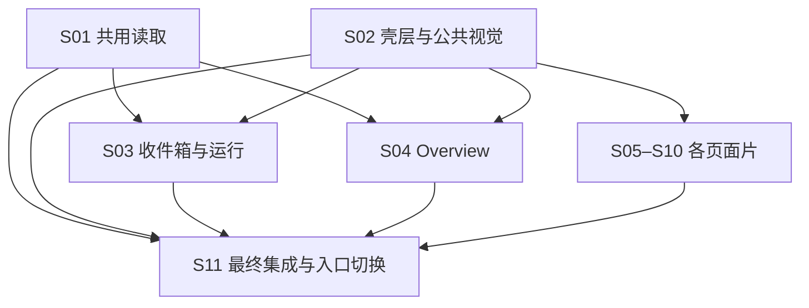

# 可供 /to-tickets 使用的切片规格

`DASHBOARD-IMPLEMENTATION-SPEC-r1`。固定 **10 个实现片＋1 个最终集成片**，全部产品状态 **NOT RUN**。本文提供可拆票的责任及验收边界，本轮不创建票据。各片必须同时引用 [SPEC](SPEC.md)、[接口合同](INTERFACES.md)、[验证规格](VALIDATION.md) 及 [traceability.json](traceability.json) 中自己的完整 source ID 集合；下列重点不是全量源责任的替代。

## 准备与依赖

开工前固定设计归档、产品候选及 S01／S02 接缝，建立隔离施工与公共补丁整合规则，并使集成分支具备项目等价 CI。这些是实施准备条件，不另开一个产品片，也不把“推荐先做”登记成 blocker。

| 片 | 硬依赖 | 公共接口责任 |
| --- | --- | --- |
| S01 | 无 | I00–I05 读侧；I08 中设置写入不归本片 |
| S02 | 无 | I06–I07、I08 生命周期适配、I09 兼容；与 S01 共同冻结读端口 |
| S03 | S01、S02 | I03–I05 的收件箱／运行消费者及来源返回 |
| S04 | S01、S02 | I01–I03 的 Overview 消费者、真实 `/overview` |
| S05 | S02 | Memory 页面与 I08 回执／保护 |
| S06 | S02 | Behaviour 页面与 I08 聚合／拓扑／统计 |
| S07 | S02 | Tools 页面与 I08 来源授权 |
| S08 | S02 | Models／Connections；I08 设置清空修复 |
| S09 | S02 | Ops 固定来源与 I08 正文分离 |
| S10 | S02 | Database 查询所有权与 I08 清理 |
| S11 | S01–S10 | 最终入口、G01–G08、全部 AC／源项及产物 |

S01 与 S02 在接口冻结后可并行；S02 不等待 S01 成品。推荐先用 S03 走通详情／返回，再完成 S04 主链验收，但 **S03→S04 不是硬依赖**。页面间完整链路由 S11 收口，不据此在 S05–S10 之间加虚假实现阻塞。

## S01：共享只读数据与定位

**交付行为：**通过真实 Host／SQLite／HTTP 取得完整三类 Overview 来源、安全 Run 元数据、有界来源恢复和一条精确正式记录。尽管没有独立新页面，HTTP 结果及失败模式构成可单独验收的产品能力。

**实现范围：**提取账目请求内聚合而不占用 Ops 保留快照；为 Store／查询服务补可选完整 count；统一用途分类；提取持久记录判据和聚合摘要；为会话／消息／Run 添加稳定定位锚点；扩展 MainBar 精确读取。读侧、HTTP 适配、现有消费者兼容与行为验证同片交付，不切成无法独立验证的“加字段”子票。

**必须证明：**超过原第一页的完整指标、自然日与时间损坏、价格未知／零／微小正数、同修订双 count、无能力来源失败；非获准摘要不披露，未知用途可见；坏收尾证据不冒 recorded；早期目标不逐页扫描，旧同文消息不合并，等待段不可穿越；未保存投影命中不被记录锁阻塞，内容与记录状态分开；成功／失败／取消后无所属资源泄漏。现有 Ops／reply／分页消费者仍能使用。

**完成出口：**I00–I05 的真实接口与失败证据、旧消费者回归和片内独立评审；UI 焦点、精确定位入口及整条跨页路径交 S02／S03／S04／S11。重点 AC06–AC08、AC11–AC12；完整 AC 集见机器索引。

## S02：壳层、唯一 MainBar 与公共呈现

**交付行为：**九个现有页面在新壳内仍能完成既有操作；MainBar、Stream、草稿、面板历史、焦点和页面保护在跨页／断点变化时保持。

**实现范围：**统一 page registry、tokens、控件与页面容器，导航协调及 dirty 守卫；逐一适配旧九页控制器和隐藏／离页差别；单层面板 history、标签页安全偏好、新回复提示、公共状态和可访问性；MainBar 的定位读取端口、身份合并与回到最新。既有业务发送、重连和记录协议复用。

S01 尚未合入时，可在公共读取传输边界用明确 fixture 推进定位端口；壳层的普通九页、Session、Stream、输入和清理必须用真实现有实现。fixture 通过仅是端口局部证据；精确 MainBar 全路径要等真实 S01＋S03，不写成 AC07 已完成。

**必须证明：**路由及正常新标签语义、同地址不重建；Back／Forward 取消离页后 URL 与页面一致；面板切换不叠层、不 dispose；Database／Memory 隐藏保护继续；未提交输入与在途动作分别处理，迟到回执不清新输入；每标签页最多一个活跃 EventSource 所有者，普通导航无新连接／Session／Run；两种断点下可操作区域、焦点、真实草稿和阅读位置保持。

**完成出口：**I06–I09 稳定、九页行为及公共样式影响验证、片内独立评审。S04 前允许尚无 Overview 内容；最终 `/` 入口 AC01 由 S11 在真实十页候选验收，不在此提前 PASS。

## S03：收件箱、运行与精确回复入口

**交付行为：**收件箱只读预览、独立消息／会话 Run 分区、运行筛选、密集详情及有界来源返回可用；明确点击才能切 Session 并定位主对话回复／草稿。

**实现范围：**接入 I03–I05；中央 680 px 表格／字段卡等价；详情按既定组排列并保留常驻异常摘要、Graph 同源图文及锚点、当前记忆核验、trace 完整性／导出／原生下载。详情不展示第二份正式回复，返回来源 `all` 等筛选不被目标分组覆盖。

**必须证明：**预览 B 不影响 A；早期回复读取量不随历史页数增长；定位／普通历史／正文恢复交错去重，未读邻居留缺口；no_reply、withheld、未保存可读和重启不可读分别表达；在途改选／移焦拒绝旧写回；记录与过程缺口不折叠隐藏；面板隐藏不取消导出，真正离页按原协议收尾。不能将“传输结束”写成“文件已保存”。

**完成出口：**#89 全部源项片段、真实 S01＋S02 组合、相关公共补丁合入及独立评审。与 Overview／Ops／Memory 等另一端的完整路径交 S11；主链 G01 的可用组合证据可在最终候选适用时复用。

## S04：真实 Overview

**交付行为：**真实三指标、静态关系说明和五条终态＋至多一个当前槽；无需已选 Session，页面进入不建会话或运行。

**实现范围：**接入 I01–I03 并注册真实 `/overview`；三个数据区分别读、刷新、失败、撤销、过期。静态架构说明沿 #88，不声称探活、配置保存或执行成功；期间到 Ops 传固定日期与时区，最近 Run 进入已有详情并保留来源。

**必须证明：**完整后端数据跨页时卡片仍准确；跨午夜／价格变化导航说明为新来源；期间改变只影响期间区；单区故障不把另两区报空；隐藏时 memory revision 撤旧值；断连、重连、新实例、失败重试与十五分钟时效不互相续期；重复进入／取消不耗 Ops 槽、不释放别人的 snapshot；新终态只提示刷新，持久列表与当前槽不重复。

**完成出口：**#88 真实接口＋页面证据、静态资源登记、独立评审。`/overview` 可访问；默认 `/` 仍待 S11 切换。无需把 S03 人为设为硬 blocker；最终详情／返回链 G02 由 S11 整合。

## S05：Memory 内容、维护及 Skill 目录

**交付行为：**内容搜索／分页／新建／编辑与维护进度有清楚分区；输入、冲突、遗忘、清理和 Skill 来源可查。

**实现范围：**#90 Memory 全部路径；列表详情长内容、折叠摘要、目标守卫、operation 回执核验；遗忘范围确认、提炼审核／重试、镜像维护及外改确认身份；只读启动 Skill 快照及覆盖说明。

**必须证明：**折叠保有效输入；目标替换经守卫；冲突保原输入与新版本比较；掉回执复用原 operation ID，只读恢复／显式恢复不再造动作；迟到回执不清新输入；数据库删除与 cleanup 分开，外改确认不能复用于新文件；隐藏副本保护失效不可复活。

**完成出口：**#90 对应 source ID 片段和真实命令／持久状态证据、独立评审。G03／G04／G07 的其他迁移页面由 S11 补全；本片提供真实遗忘／修订触发能力和观察点。

## S06：Behaviour 设置、拓扑、统计与聚合

**交付行为：**分流表单显式保存，两张流程图与路由统计可读，聚合输入／结果有固定目标与独立状态。

**实现范围：**#90 Behaviour 全部路径；按项 dirty、冲突与损坏恢复、图文同源、统计数表／比例，手动聚合来源选择与结果入口。图的旧快照可标旧，统计按原协议撤值，不合成统一缓存。

**必须证明：**看图／统计不保存；未知版本、零分母和覆盖正确；在途编辑与旧响应隔离；聚合冻结原 Session 和输入，不因后续改选改投；未选资料不读、发送前按原许可复核；NoAction、失败、非法候选、未保存及合格草稿分别显示，历史资料不恢复到当前发送状态。

**完成出口：**真实设置／拓扑／统计／聚合接缝及片内评审；结果进入原目标的既有入口可证，G04 的两端迁移及 Memory 联动待 S11。

## S07：Tools 来源、授权与人格发现

**交付行为：**当前／退休工具依真实来源分组，同名工具不混淆；连接、授权草稿、保存和生效分别可见，原详情／核验入口可达。

**实现范围：**#90 Tools 全部路径；长标识完整入口、折叠保持草稿和异常、来源替换／退休处理、人格工具发现，显式调用仍由 MainBar 发出。

**必须证明：**完整 source identity 而非显示名是对象键；冲突保比较、掉回执不自动重送；换源不继承旧权限，连接成功不冒授权生效；Persona／Skill 版本与覆盖拒绝继续可见。

**完成出口：**授权／MCP 来源的真实片内证据与独立评审。Tools↔Connections、Tools→Ops→Run→原快照以及人格结果链分别交 G05／G03；无需预先加 S08／S09 为实现硬依赖。

## S08：Models、Connections 及清空持久语义修复

**交付行为：**模型目录／指派／明细与连接维护按既定分组可操作；已有显示名和最后一维覆盖价可真实清空。

**实现范围：**#91 对应页面的全部路径；独立保存显示名／线路／四维覆盖、冲突、保存中新增编辑；I08 的设置命令修复；具体已保存模型探针、推理凭据重读、Tavily 观测、MCP 应用／重连／清理。修复和 UI 改动分别可追踪，不拆成遗漏持久语义的纯换肤票。

**必须证明：**清空后重新打开 store 及 HTTP 重读确认，空与 0 不同，最后一维移除恢复原价格链；未指定参数旧行为不退化；并发 expected revision 冲突保草稿；探针使用保存目标并连到正确 Run／Attempt／费用；受理未知不自动重送，连接状态不冒支持／认证成功，维护未清理不冒完成。

**完成出口：**真实 settings command/store 修复证据、页面／连接片内证据、独立评审；G05／G06 的其他端待 S11。登记必须保留的修复提交和支持回退目标，UI 回撤不自动撤掉语义修复。

## S09：Ops 固定账目与来源返回

**交付行为：**固定期间／时区／身份／价格的账目、完整 Run 与工具分项及历史正文可以分别核对，跨页返回仍指向原来源。

**实现范围：**#91 Ops 全部路径；筛选草稿／显式创建 snapshot、列表／明细、分项金额与覆盖、历史正文与当前核验、现有来源 query 及过期出口。

**必须证明：**全局 summary 不当逐 Run 金额；模型 USD 与工具 service/unit 分列；价格变化不改旧快照；正文失效不抹财务，财务仍在也不能恢复失效正文；snapshot 过期返回明确核对并刷新，不自动创建替代账。与 I01 保持兼容，不为共用视觉擅增未批准字段。

**完成出口：**真实 snapshot/page/detail＋历史保护证据及独立评审；G02／G05／G06 完整路径交 S11。

## S10：Database 编辑、结果与清理

**交付行为：**数据库目录、SQL 草稿、已提交查询及结果各有清楚归属，取消／预算／清理／保护状态真实可见。

**实现范围：**#91 Database 全部路径；目录／示例、输入守卫、查询、分页、列／行截断说明、复制与大内容、取消和清理。结果寿命依原协议，不套普通页缓存。

**必须证明：**示例只改编辑器且替换有守卫；提交后修改 SQL 不改旧结果标题／归属；真实 worker 的超时／行／列／字节界限；取消请求不是完成；cleanup 未释放不发新查询，句柄签发和执行准入仍分别核对；真实遗忘后在途结果、DOM、复制及可复用副本失效；隐藏不误离页，文档卸载／实际离页仍按原资源协议执行。

**完成出口：**真实 worker／HTTP／浏览器片内证据及独立评审；G07／G08 的跨页与运行切换交 S11。历史 BFCache BLOCKED 保留，不能弱化 no-store 获取“通过”。

## S11：最终组合、默认入口与运行切换验收

**交付行为：**十页在同一候选完成全部源合同，默认 `/` replace 到 `/overview`，旧地址兼容；跨片链路、视觉／原生交互／移动模拟、构建资源和支持目标回退有证据。

**实现范围：**最后入口切换与品牌入口；组合冲突及真正缺口修复；全部源项与 26 AC／12 MCE 的证据裁定、8 链路、完整项目门禁、wheel／sdist 四安装组合、资源 HTTP、正常关停与同状态升级回退。不得只增加一张“跑测试”空票，入口变更本身属于此候选。

| 链路 | 最终组合责任 |
| --- | --- |
| G01 | A 草稿／流式回复跨十页→预览 B→Run→返回→显式跨 Session 精确定位→回到最新，含面板／Back／Forward／reload。 |
| G02 | Overview 完整来源→Ops 固定期间或 Run→返回，跨午夜、价格变化及快照过期。 |
| G03 | Memory 保存→实际 Attempt／当前引用；Skill／人格显式使用→结果及 Run 证据。 |
| G04 | Behaviour 保存→下一 Run；聚合固定目标→Run→原 Session 草稿；Memory 保护变化使资料失效并发送前复核。 |
| G05 | Tools↔Connections→换源／退休／维护→授权／可用／清理→Ops→Run→原 snapshot。 |
| G06 | 清空覆盖→持久重读→新价格链；探针→正确 Run／Attempt／Ops；旧 snapshot 不改。 |
| G07 | 真实遗忘→隐藏 Run 引用、Overview count、聚合资料、Database 在途／结果／复制副本失效；迟到响应不复活。 |
| G08 | 正常关闭→整包升级→旧标签刷新→支持目标回退，在同一隔离持久状态核对全部保留事实。 |

**完成出口：**最终候选 source/base/head/tree／产物身份、独立 Standards／Spec 评审、所有必需源责任与组合证据成立，无未处理关键 FAIL／必需 BLOCKED。报告移动模拟范围、真实桌面 200%／IME、历史 BFCache、首次失败及未执行范围。通过仍不代替 Git 交付／发布授权。

## 共享补丁、交接与撤回

- S01 拥有读模型、Host 读 facade 与相应 HTTP 合同；S02 拥有壳层、Stream 消费者、公共 CSS／控件和共享页面容器。页面片提交自己的限定补丁，由相应公共所有者或集成者串行合入，不整个覆盖共享文件。
- S08 拥有设置清空语义修复，即使实现落在公共设置命令中；S01 的“共享”不包含写入责任。页面私有模块拆分可由实施者选择，不重新访谈。
- 每片交接必须包含固定源引用、实际代码与依赖候选、公共合同版本、完整 source ID／AC 对照、已完成片段／未完成组合、检查适用性、独立评审、资源清单及具体可回退候选。标准状态为“本片实现与片内证据就绪，跨片路径待 S11”。
- 叶片回撤也须移除或降级所有指向它的新入口；共享 S01／S02 不可在保留消费者时独立撤回。回退闭包与保留修复须有证据，不默认任意历史 main 安全。
- 后续拆票不得把本轮文档静态 PASS 贴为产品 PASS，也不得将 309 行各拆一票／一测试；已有行为用例可以关联多个真实责任。拆票仅登记表中硬边，排程建议保留为 Notes。
