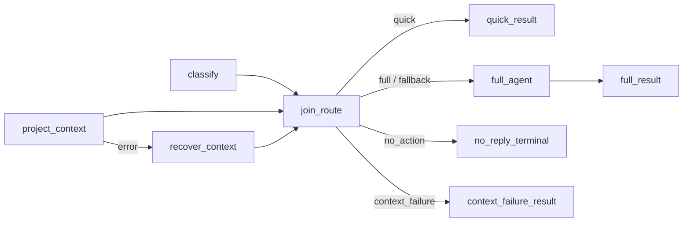

# #26 消息分流实施规范

Part of [#1](https://github.com/nineofoursyrup/Agent-Alfred/issues/1)；目标 [#26](https://github.com/nineofoursyrup/Agent-Alfred/issues/26)。

revision: ROUTING-SPEC-r1 | 2026-09-14 | ready-for-agent（规范就绪；发布状态另见 LOOP）

## Problem Statement

Alfred 当前聊天默认进入普通循环，用户不能显式开启消息分流来区分纯社交短消息、实际任务与明确无需回复的消息。已有 Graph 接缝缺少正式业务图与 Behaviour 入口，分类转录、无回复呈现、失败回退和 MCP 动态工具目录若处理不一致，会造成任务被吞、虚假空回复或重复动作。

## Solution

交付默认关闭、CLI/Web 共享的消息分流能力和最小 Behaviour 设置页。启用后以辅助模型分类当前任务，与已准备上下文的纯投影汇合，经代码保护后选择固定短回复、完整 Agent 循环或无回复终点。保留一次 Skill 选择、共享预算、真实费用、来源核验及唯一 finalizer；上下文失效和副作用后的停止规则明确可验。用户可查看持久路由/恢复原因，并在设置损坏时显式备份恢复。

本文等义综合已获 D4 整体确认的设计。实施与验收以 ROUTING-SPEC-r1 为唯一权威定义；所有要求、决定、精确规则、CE 与验证接缝均内联，无需读取设计聊天或未发布 companion。设计源作为冻结批准依据，不再并行演化验收合同。

## User Stories

1. As a CLI/Web 用户, I want 显式开启或关闭消息分流并在下一 Run 生效, so that 默认聊天行为保持可预测。（R01；Q1/Q10）
2. As a 聊天用户, I want 纯问候/致谢获得固定短回复、真实任务进入完整循环, so that 简单交流不会吞掉实质需求。（R02/R03；Q2/Q6）
3. As a 聊天用户, I want 明确无需回复且无任务的消息只保留用户记录, so that 不收到空助手消息或虚假的长期保存回执。（R03；Q3/Q14）
4. As a 使用 Skill 的用户, I want 回答路径共享一次选择及 Run 预算, so that 路由不会忽略已加载的 Skill 或扩大调用额度。（R06；Q4/Q5/Q8/Q9）
5. As a 用户, I want 故障如实报告且只在可证明安全时回退, so that 已发生或未知的动作不会自动重做。（R04/R05/R07；Q7/Q13）
6. As a 用户, I want 刷新、重启后仍能查看路由、无回复及恢复事实, so that 在线通知丢失不改变结果解释。（R07；Q11）
7. As a 本地维护者, I want 备份损坏配置后恢复默认关闭，并让图与工具目录一致发布, so that 修复设置或重连 MCP 不产生半套配置。（R01/R05；Q15/Q16）
8. As a 维护者, I want 真实用户入口的离线验收覆盖正常与故障顺序, so that 能验证上述行为而不依赖付费模型或伪造内部返回。（R08；Q12；F06/F07）

## Implementation Decisions

### 批准来源与基线

- D1：Q1–Q5，用户回复“全按建议”；D2：Q6–Q12，同样回复；D3：Q13–Q16，同样回复，均在 2026-09-14。
- D4：用户对完整 ROUTING-DESIGN-r4 回复“确认”。批准 SHA-256 `bc1afd6a76e82f6349cd20ee2c80967000021ce8c402ea028a6a8a7b57bbb448`，覆盖 R01–R08、Q1–Q16、F01–F07、CE-01–CE-14、CONTEXT 和 ADR-0036/0037。ROUTING-DESIGN-r5 仅登记批准，SHA-256 `ca9b643d45638d9bad1a8ebeb5c745bad3643f0118a7ad3cd9eecdc478998a71`。
- 本次 to-spec 没有新增、删除、替换或豁免任何已批准要求/CE。内部文件布局、具体新命令拼写与模块拆分按仓库惯例决定；不能借此改变协议含义或验收。
- 本地工作树 `/Users/nineofour/Agent-Alfred-issue-26-design`，分支 `codex/26-message-routing-design`，base/HEAD `8ba7192ee84533aef3deb8453d8fa7364d67f48b`。本次远端 main 回读相同；#26 OPEN，仅 wayfinder:task 标签、无评论。产品尚未开始实现。
- 继承 [#6 裁决](https://github.com/nineofoursyrup/Agent-Alfred/issues/6#issuecomment-5429217158)、[GRAPH-SPEC-r1](https://github.com/nineofoursyrup/Agent-Alfred/blob/8ba7192ee84533aef3deb8453d8fa7364d67f48b/docs/design/issue-25-graph-spec.md) 和 [SKILL-SPEC-r1](https://github.com/nineofoursyrup/Agent-Alfred/blob/8ba7192ee84533aef3deb8453d8fa7364d67f48b/docs/design/issue-24-skill-spec.md)。原票“非 Completed 均回退”按 R04/R05 的后续已定合同解释；Q7 的投影错误边界及 Q16 的受控新图代际是显式批准的限定，不由旧原句反向覆盖。

### 领域与 ADR 约束

Run/Step/Attempt、会话记录、工作记忆、运行转录、Graph、恢复和副作用三态沿 [CONTEXT](https://github.com/nineofoursyrup/Agent-Alfred/blob/8ba7192ee84533aef3deb8453d8fa7364d67f48b/CONTEXT.md)。消息分类是控制数据，不是助手回答；静默记入会话不代表长期记忆保存，不构成完整问答对。工具与图配置代际是一起发布的声明与冻结图配对，不等于 topology_hash 或模型版本。

ADR-0010/0011/0012 的单写者/波快照、有限能力缩减、共享预算；ADR-0022 的双重冲突；ADR-0019/0024/0026 的屏障、记录事务和准入租约；ADR-0032 的真实工具计量继续适用。相关新增 ADR 全部行为已内联：

- **ADR-0036（Q8/D2）**：分类专用输入不携历史/Skill/人格/工具，输出不加入回答转录；独立记真实输入与费用，回答仍做来源重验，不改变普通 agent_node 的有效转录共享。
- **ADR-0037（Q16/D3）**：启动与受控工具目录发布时编译新冻结图，与 Registry 同代发布；不每 Run 编译、不 wildcard。名单变化影响 hash、schema-only 变化另记能力身份；失败不混配，也不声称 MCP 资源被回滚。

### 模块与公开接口责任

| 模块/边界 | 当前事实与本票责任 |
|---|---|
| runtime/host、execution、wiring | 现有 chat_graph_factory 是注入接缝，正式 wiring 尚未启用本票业务图；按捕获 Behaviour/模型/代际选择一张或不执行图，命令及非chat路径保持原行为 |
| graph builder/registry/nodes/context | 复用真实确定性引擎；新增窄的每 Run 模型依赖绑定、分类输入/转录隔离和可信上下文失效证据；默认保持既有 Graph 行为 |
| runtime/memory 与输入所有者 | 实际 prepare/evaluate 形成有来源的 JSON 快照；纯投影结果被完整回答消费，模型每次发送前依既有遗忘/版本/容量规则重验 |
| Behaviour 与 settings mutation | 新增独立版本化配置域、读/保存/显式备份恢复的共享命令语义及 UI/HTTP/CLI；复用 Host gate，不混入 Models 的指派所有权 |
| runtime/chat_graph、recording、sessions | 结果适配、单次允许回退、唯一 finalizer；持久路由/原因/恢复与 reply_disposition；NoAction user-only 单列有意排除 |
| events、trace、运行详情/正文查询 | 有限 notice code 与准确路由证据，在线/刷新/重启/裁剪后的结果一致，trace失败与recording失败分开 |
| MCPControl、Registry 发布、工具授权 | 在已有 mutation lease 内准备及发布图/Registry配对；动态能力身份与安全暂停不因旧快照复活 |

本文路径指 `src/agent_alfred/` 下既有模块，新增布局由实施者选择。以上是实施责任，不能把现有每 Run 工厂或仅保存最终 error 的结果当作这些接口已经完成。

### R01–R08 要求索引

| ID | 合同与来源 |
|---|---|
| R01 | 默认关闭；Behaviour 显式开启；关闭时保留普通循环既有行为（#26、#6 §16）。 |
| R02 | 确定性 DAG：分类 llm_node 与上下文节点同层，汇合后按闭合标签路由；未知模型字符串显式映射 fallback，模型不决定 node_id（#26、#6 §1–§5）。 |
| R03 | 快速回复 result、完整 agent 后 result、每个不回复原因独立 no_action 终点；恰一成功终点（#26、#6 §7–§8）。 |
| R04 | 上下文普通失败走专属 error 恢复；CompletedWithRecovery 携恢复记录；NoAction 如经恢复也保留记录，均不自动回退（#25 Q1/Q2）。 |
| R05 | 仅 Failed/BudgetExhausted 进入失败处理；持久 notice；只在副作用 none 且没有强制收尾、取消或总截止时允许普通回退；剩余预算不足不能发请求（#6 §12–§13、#24 Q23）。 |
| R06 | 全 Run 共享 Step 预算、绝对 deadline 与一次 Skill 快照；分类不自动携 Skill，回答/Assistant 路径遵守已确认 Skill 合同（#24 Q8/Q19/Q23）。 |
| R07 | 真实费用/工具动作不因波撤销退回；失败候选不能污染有效回答、合法回退或下一 Run；finalizer 独占会话落库（#25 CE-15/16）。 |
| R08 | 离线模型用 ScriptedModel；验收真实 Graph、Host、Registry、SQLite、记录、HTTP/SSE 与必要浏览器链路；不把模型语义质量当作离线脚本已经证明（#26 与 #24 的已有验收原则）。 |

原票“捕获非 Completed 结果”的简写须按 R04/R05 解释，不能覆盖后续已批准合同。

### 已确认决定 Q1–Q16

### Q1 本票的产品入口

确认交付最小 Behaviour 页：一个默认关闭的消息分流开关，持久化并在下一 Run 生效，CLI/Web 共享同一设置；本票提供所需 HTTP/命令入口。不扩为通用流程编辑器、选图器、完整 Graph 可视化页或 #27 手动聚合。

### Q2 快速回复的业务能力

确认首版仅覆盖纯问候/致谢等无任务、无事实查询、无需工具的短社交输入，用代码固定短回复。分类 llm 只给分类数据，不直接供应用户答案；有实质问题、动作要求、上下文歧义一律完整循环。这样“快速”指少走后续回答步骤，不保证整个 Run 没有其它输入准备调用。开放式短答不纳入首版。

### Q3 无动作的业务含义

确认首版只表达“用户明确要求无需回复，且没有待执行任务”；保留本条用户会话记录与 Run 事实，不生成助手消息，不新增语义/情景记忆写入。仅凭模型认为消息不重要不能静默吞掉用户提问。“记住某件事”是实际动作，不能归为这种无动作；“保存到长期记忆且不回复”的专用组合能力不纳入本票；会话落库不能称为长期记忆保存。此类输入不能被分流器当作已办完的无动作，仍交普通完整路径处理，本票不承诺该路径新增静默保存能力。

### Q4 上下文节点与既有输入准备

确认沿用 #24 已有的图前 Skill 快照及现有检索准备，图内上下文仅消费已取得的当前会话/检索快照，不再重复跑检索门或新建检索策略。本票先完成真实分流闭环；把 gate 延后到某条支路、以减少模型调用为目标的输入准备重排不顺带进行。节点真实投影接口及可控失败接缝见 Q7/D2 与 F03/F06，不以无业务含义的占位节点冒充验收。

### Q5 分类模型指派

确认沿用当前辅助小模型指派 `retrieval_gate`，未指定时使用本 Run 捕获的 `primary`；不新增第三个模型指派位。运行详情展示实际分类模型及用途；显式指派存在但不可用不等同于未指派，不静默换主模型，按分类失败的恢复合同处理。Models 文案需如实说明这个位置同时服务检索门、Skill 选择与消息分类，持久字段兼容既有配置。

### Q6 闭合分类与防止误吞任务

确认模型只返回 `greeting` / `thanks` / `no_reply` / `full` 四种字符串；首尾空白允许，大小写、Markdown、JSON、解释文本均不做猜测解析，未识别统一映射显式 `fallback` 标签到完整循环。`full` 与 `fallback` 可指向同一 agent，但持久路由依据不同。

快速/no_action 再受代码保护：必须整条有效任务文本匹配一份有限的自包含表达表，不做子串匹配、不让模型自行宣称“没有任务”。第一版确定纯问候（你好、您好、嗨、hello、hi）、纯致谢（谢谢、多谢、感谢、thanks、thank you）、纯不回复（不用回复、无需回复、不必回复、无需回复，也不需要做任何事）；仅允许首尾空白、英文大小写规范化和有界末尾句末标点，完整清单/规范化见下方整合规则 F01。不匹配即 `fallback`，未知不是用户错误。

出现已加载 Skill 时关闭固定快速回复，交完整 Assistant 使用同一 Skill；合法 no_action 仍不为“用掉 Skill”造回复。明确工具/保存任务以及“你好，查地址”、引用里出现“无需回复”等不能进入零动作路径。社交输入超出有限清单会更常走完整循环，这是保守范围的代价；不宣称 ScriptedModel 证明真实分类语义质量。

### Q7 纯上下文投影的失败到底承诺什么

D1/Q4 保留图前读取与检索，故图内 fn_node 只能对**已准备、具有明确版本/字段合同的 JSON 形状快照**做校验、规范化和投影；不能悄悄再读 SQLite。通过显式 declare_input 提供快照，fan-in/完整回答消费其有序会话/检索来源信息；不能闭包偷读 RunMemory 私有字段，也不能放一个不被消费的占位 key。

确认明确细化原票“上下文读取失败”：本图 error 恢复测试针对上下文投影节点的真实合同失败（例如合法 Graph state 中快照版本/字段类型非法）；它证明防御式失败处理，不冒称证明数据库故障可恢复。普通投影失败走零 Step 专属恢复，输出固定“本次上下文准备失败，请稍后重试。”并返回 CompletedWithRecovery，携恢复记录；如果满足已确认不回复条件，则 NoAction 保留 recoveries、仍无正文。不在上下文坏掉后继续运行带工具的 agent。

图前获取失败、发送前遗忘/版本核验错误、InputEvidenceError/InputResolutionError/InputLimitExceeded、取消/总体 deadline 沿既有失败/固定收尾传播，禁止伪装为空上下文后继续。正常回答发送前继续真实的来源复核，纯快照不绕过遗忘合同。

**这是 D2/Q7 显式确认的验收边界细化**：原票字面易被读成“SQLite 失败也 CWR”，而 D1 已选择不把 SQLite 读取移入图内；不默改原要求。

### Q8 分类输入与回答转录隔离

确认分类器只接收固定分类指令与已解析的当前 task，不接收 persona、Skill 正文、历史、工具证据、长期检索正文、工具 Schema；不因分类再进行一次资料检索。保留真实 model/Step/Attempt/输入限额与脱敏记录，按实际来源建立输入证据，不能假称携带了未发送的参考资料。

分类产物只写分类 state 与审计事实，不追加到给回答模型使用的运行转录。完整回答仍接收 Q4 已准备上下文、合法来源及一次 Skill 快照，发送前依现有规则重验；Graph 失败后的普通回退也不携分类对话。现有 `answer_request` 保留节点 model/system/task，不存在覆盖分类模型的问题；待补的是有意的输入隔离与转录归属，不改通用 agent_node 共享有效回答转录的既有语义。

### Q9 分类预算、异常与普通回退

确认分类器局部时限复用 `gate_model_budget_s`（当前默认 5 秒），effective deadline=min(分类开始+该值, 全 Run 绝对 deadline)；不增加设置项。一次分类扣一个 Step，真实重试沿同一 lease，不再加一层应用重试；所有实际 Attempt 计量。完整分类请求超限时不截断原 task 后据残文分流，分类零网络请求，按已声明普通失败规则回退；已取得的 Step 不退。

成功返回未知字符串按 Q6 在图内显式 fallback；分类普通失败/局部超时进入图失败处理，先发持久 notice，再仅在 none、无强制停止且剩余额度允许时执行普通循环。显式辅助模型不可用不得悄悄改模型重试分类；允许的普通回退使用其本来主模型并明确报告分类失败。总体超时/用户取消/来源或输入证据不明/固定收尾不恢复。分类花掉最后一步时，合法零 Step 终点仍可成功；完整回答无法申请新 Step时如实 max_steps，不重置预算。

### Q10 Behaviour 设置冲突与损坏

确认 Behaviour 独立拥有自己的带版本持久设置与 revision，复用现有设置的双重冲突和先落盘再发布规则。默认文件不存在=关闭；格式损坏/较新未知 schema 禁止启用且明确报配置错误，不把错误当成用户主动关闭，不覆盖原文件。模型指派继续归 Models。

沿当前 Host mutation gate：accepted/running/recording_pending 或已有 mutation 时 `409 mutation_in_flight`；记录器不可用 `503 recording_unavailable`，shutdown `503 admission_failed`；空闲时旧 revision/外部文件更改分别 `409 settings_conflict` cause=`stale_revision`/`external_change`。不排队、不自动重试覆盖；UI 保留选择并提示刷新，成功必须持久回读后显示。全局空闲保存成功，下一 Run 捕获新值，跨重启有效；运行中不能同时改开关。

损坏恢复的操作合同见 Q15/D3 与 F05；实现前不宣称已存在可用重置命令。存储文件格式/路径与 schema 常量属实施细节，但错误状态、不可覆盖和用户恢复能力必须成为验收合同。

### Q11 用户可见结果与持久路由依据

确认 MainBar/CLI 的正常快速及完整回复照常显示；NoAction 不产生助手气泡或回复正文，在运行状态显示“已结束 · 按要求未回复”，详情展示稳定 reason_code 对应固定文案。CompletedWithRecovery 显示降级事实；失败且阻止重跑清楚说明动作已发生/结果未知。

Run telemetry/API 持久保存图身份、有效路由标签、规则原因、GraphResult 类型、no_action 原因/恢复记录、分类实际模型、回退决策与禁止原因；不把自由分类原文当用户提示或正式答案。SSE 只通知，刷新/重启依 SQLite 可恢复，trace 被裁剪也不丢必要运行结论；原始分类文本沿既有脱敏 trace 存放，不复制进会话。

Graph 失败先经既有持久 Notice 家族发布声明过的 code 和机器可读原因，最终 telemetry 保留同一决策。沿 ADR-0019 在正常 Run 屏障后确认 trace 持久性，不在回退前新增 fsync。trace 写失败沿既有“业务继续、trace_incomplete”合同并如实显示；记录事务失败则 recording_failed/503，不能以 SSE/内存结果冒称已保存。发送前内部不变量错误、取消或固定收尾仍按原规则，notice 不是额外回退许可。

### Q12 “关闭时逐字节一致”的比较对象

确认固定输入、脚本、时钟/ID与数据库逻辑初态，旧基线普通入口对照新实现关闭入口：比较完整序列化模型请求（model/system/messages/tools/参数及顺序）、回复块/CLI 正式回复、会话消息公开响应、既有领域事件的身份/顺序/载荷、Run 业务结果与计量事实。不得删掉分类/工具/来源事件后再比；关闭时零新分类请求、零 Graph/路由 notice，不改变 Skill/检索顺序或预算。

SQLite 文件页布局、随机端口、HTTP Date 等传输环境字节不作为业务等价对象。动态身份/时刻优先固定；必须规范化的环境字段需在验收清单逐项列明，不能宽泛删时间/ID或只比最终文本。Behaviour 设置 API 作为新增产品面单独验收，不要求旧基线存在。真实 CLI 与 HTTP/SSE/browser 链都覆盖；业务组件真实，只有外部模型/服务边界可替换，公共时钟/ID/故障控制可注入。

### Q13 上下文恢复本身失败时禁止绕回完整循环

反例：project_context 校验失败 → recover_context 自身抛异常/漏写 → Graph Failed(side_effect_state=none) → 外层旧逻辑自动普通循环，绕过 Q7“上下文坏掉不继续带工具回答”。同类漏洞是 project 声明 writes 但成功漏写，下游 join 失败后回退。

确认在投影节点可恢复执行边界内验证其完整输出，漏写/类型不符同样成为该节点普通合同失败；成功恢复沿 Q7。不可信上下文已由实际失败证据确定后，恢复节点/汇合校验失败直接结束 Run，保留结构化原因与实际费用，不再普通回退，不执行后续模型/工具。涉及上下文故障的比较中，分类先失败、投影未开始且没有失效证据时仍沿 Q9/R05 允许回退；正常上下文完成后的 full_agent 无副作用普通失败同样按 Q9/R05 判定，不被本条禁止。

推导依真实 node_id/错误类型/图失败证据，不使用图作者随意设置的 fallback_safe 布尔。当前 Failed 主要保留最终错误，因此实现须增加窄的可信失效事实通道，明确绑定实际投影失败及 Run/图身份；不能仅从恢复节点的名字猜测上游事实。错误恢复事实不能因整波撤销而消失，业务 state 回滚与已观察失效事实分开。固定收尾/取消/总截止仍优先，不以本项替换其已确认回执。

### Q14 NoAction 在下一 Run 的工作记忆中如何处理

事实：当前 `runtime/execution.py::_load_working_memory` 以同一 run_id 的 user INNER JOIN assistant 构造成对窗口；NoAction 的 user-only 记录不进入下一次模型输入，却被统计为 incomplete。`memory/consolidation_service.py::_source_from_log` 同样要求完整问答对。本票只确认保留会话记录，未承诺把单条无回复消息加入模型窗口。

确认保持既有成对工作记忆与提炼来源规则：NoAction 用户消息可在会话查看、刷新和重启后保留，但不加入后续模型工作窗口，不作为本票新增的提炼来源。对有持久 NoAction 事实的 Run，单列 intentional_no_reply 排除原因，不能谎称 incomplete；没有可信无动作事实的缺助手记录仍沿原不完整规则。严禁伪造空助手消息、把 B.user 与 C.assistant 配成一组，或借 #26 重做变长消息组。

### Q15 Behaviour 配置错误后的可用性与恢复

确认格式损坏/未知新 schema/文件读取失败时，把分流标为 unavailable，明确原因；普通聊天仍可用，进入普通循环前发结构化 notice，不能称为“用户已关闭分流”。不启动分类/Graph，不静默覆盖文件。文件不存在才是正常默认关闭、无降级 notice。

提供 Behaviour 页与 CLI 的显式“备份原文件并恢复默认关闭”操作，经过同一空闲 mutation gate。用户先读取状态，恢复请求绑定所见文件指纹/错误版本；文件变动返回冲突、零覆盖。可读原文件先逐字节写入独占的新备份并确保持久，再原子写入新版默认关闭设置，成功回读才发布内存状态；失败不得声称恢复成功。原文件不可读/不是普通文件/是符号链接等无法证明备份完整的情况拒绝自动恢复，明确要求用户修复文件访问或换用兼容版本。备份路径只作为本地管理信息，不进模型。

该恢复是用户主动破坏旧配置语义的操作，确认范围是“保留原字节后重置当前配置”；不自动迁移未知字段。配置损坏与普通开关关闭是不同的持久/运行状态，CE-01 的默认关闭等价仍只针对合法关闭配置。

### Q16 工具目录更新时能否发布新的冻结图

事实冲突：#25/#6 要启动编译并冻结静态 tool_names；真实 MCP 在用户 apply/reconnect/cleanup 后可重新发布 Registry，新增工具会被旧名单隐藏，删除工具会令 restricted(old_names) 抛错。不存在稳定的 MCP dispatcher（每个远端工具有独立名字）。因此“整个进程只用启动图”“完整分支具备普通循环同等工具能力”“MCP 热更新立即生效”不能同时满足。

确认显式限定修订启动编译规则：启动及**受控工具目录发布**时可编译新不可变图，把它与对应 Registry 作为同一配置代际发布。每 Run 捕获同代二者，运行期间不改；不是按 Run 重编译，也不让普通 Behaviour 值任意改拓扑。静态 tool_names 取该代普通循环的声明全集，实际暴露仍经相同注册状态/配置/授权筛选，不使用 wildcard 或绕过 Registry。模型客户端/模型选择需通过每 Run 绑定保持快照，不为切换 primary/retrieval_gate 重编译拓扑。

白名单增删改变 topology_hash。同名工具 schema/能力身份改变但名单不变时，**不能承诺 hash 改变**（原 hash 不覆盖 schema/实现）；需另以配置代际/Registry 身份与工具 capability identity 留证，Run 同时记录 graph schema_version/hash 与能力代际。

只在现有 mutation lease 下进行发布，busy拒绝沿 Q10；静态图/Registry 候选在发布前验证，同一发布边界安装，不能新Registry配旧Graph。发现资源操作已发生后的编译/发布失败，保留旧静态配对并明确失败，MCP 按既有 publication_unconfirmed 暂停/拒绝旧调用，**不宣称旧服务器连接已恢复**；本地未受影响能力沿既有规则继续。尚未有任何有效图时分流 unavailable，采用与本项自包含的可见降级规则：notice 后普通聊天，仅使用已核验可发布的 Registry；注册/授权状态本身无法核验则沿现有工具安全失败规则，不能编造可用工具。

成功后的下一 Run 图工具能力与同代普通循环一致；失败只报告实际已确认阶段。此项是对上游“启动唯一编译”的明确有限补充，已获 D3 裁决；旧图与旧 trace 永不被新拓扑覆盖。

### 拓扑与状态所有权

W1 按声明序 classify、project_context；W2 recover_context 执行或 skipped；W3 join_route 等全部入边决议；W4/W5 执行唯一分支。classify 无 error 目标；它的普通失败沿 Q9 在整波回滚后进入外层处理，尚未开始节点不得伪造执行/费用。project 的恢复必须仅一条专属 error 入边，无 error 出边且不可配置跳过。普通边/条件边均沿 #25 边级决议；没有偷偷提前执行的汇合或孤立终点。

| 唯一写者 | 独占 key / 用途 |
|---|---|
| 图输入 | task、prepared_context、has_loaded_skills（已准备快照，均有输入声明） |
| classify | classification；控制数据，无回答转录追加 |
| project_context | projected_context；规范化上下文 |
| recover_context | context_recovery；与正常 key 分开，不共写 context |
| join_route | route_decision、answer_context；明确收敛成功/恢复输入，后继不偷读上游 optional key |
| quick_result | quick_output |
| full_agent | agent_output |
| full_result | full_output |
| context_failure_result | context_failure_output |
| no_reply_terminal | 无输出；静态 reason_code=user_requested_no_reply |

join required 读 classification/task/has_loaded_skills，optional 读 projected_context/context_recovery，并校验二者恰一。后继 full_agent required 读 join 拥有的 answer_context；编译器不推理业务标签谓词，不把 project 的 optional 结果谎报为该路径必有。各 result 终点拥有各自 output_key；条件组每个标签仅一个目标，full/fallback 可同目标；正常/恢复 NoAction 共用同一语义终点，recoveries 由引擎携带。

路由优先级按 D2：先核验输入与来源安全合同；满足分类与整条文本保护的 no_action 优先，仍保留恢复事实；已有 context_recovery 时其余情况固定 context_failure；正常上下文才允许 quick/full/fallback。恢复失败的外层处理按 Q13/D3，不靠拼凑假成功终点解决。

### 精确执行与记录合同 F01–F05

### F01 有限文本表与固定输出

分类模型的输出仅 trim 首尾空白后逐字匹配四个小写类别，任何 JSON/Markdown/说明/节点名/额外块语义都不猜测解析；未知 category 记录为 unknown，走 fallback。分类器声称某类别不等于代码保护已通过。

保护用文本是 Skill 首行控制解析后的当前 task，**原 task 不被改写或截断**。匹配副本去首尾空白、ASCII 英文字母转小写；允许删除末尾连续 0–3 个 `。.!！`，再去末尾空白。其余字符完整保留：不展开引用/代码、不做 Unicode 相似字符折叠、不删内部空白/换行、不拆出句子。超过 3 个末尾标点、问号或附加任务文本都不命中。

| 模型类别 | 必须整条命中的规范化文本 | 额外条件 | 路由及固定正文 |
|---|---|---|---|
| greeting | 你好、您好、嗨、hello、hi | 未加载任何 Skill；上下文正常 | quick；“你好！” |
| thanks | 谢谢、多谢、感谢、thanks、thank you | 未加载任何 Skill；上下文正常 | quick；“不客气。” |
| no_reply | 不用回复、无需回复、不必回复、无需回复，也不需要做任何事 | 无其它文本，符合当前 task 保护；无需撤销已有安全失败 | no_action；无正文，reason_code=user_requested_no_reply |
| full | 任意合法 task | 上下文正常 | full；完整 agent 后 result |
| 未知或类别/文本不一致 | 任意 | 上下文正常 | fallback；同一完整 agent，持久记录未识别或保护未通过 |

例如模型返回 greeting 但 task 是“谢谢”，也不能擅自改成 thanks；走 fallback。已加载 Skill 阻止 quick 时记录 skills_require_full。控制 `/skills off` 后 task 可正常匹配，显式/自动选择最终没有加载正文时 has_loaded_skills=false；准备失败已在图前按 #24 停止。已有命令入口及非 chat 系统 Run 保持原执行路径，不被分流器吞掉。

### F02 路由与失败优先级

1. 准入/命令/Skill/输入准备/来源安全及强制停止先沿既有 Host 合同；未到 Graph 不伪造 graph.started 或分类 Attempt。
2. classify 与 project_context 执行前及模型 Attempt 前检查同一总 deadline。分类声明在前，若先发生未接管失败，尚未启动的投影不造事件/错误；取消/总 deadline/不变量不作为普通分类故障恢复。
3. 进入 join 前分类必须成功且投影正常结果/专属恢复结果恰一。任意投影/恢复结构失效按 Q13 阻止外层普通回退。
4. 分类 no_reply 且整条文本保护通过 → NoAction，即便有成功恢复记录；不能覆盖总 deadline 或安全失败。
5. 已有上下文恢复、且非合法 NoAction → context_failure_result，正文严格为“本次上下文准备失败，请稍后重试。”，结果 CompletedWithRecovery；无 agent/工具后续调用。
6. 正常上下文按 F01 选择 quick/full/fallback。只有一个条件组、每个标签一个目标。零 Step 快速/无动作终点在最后一个分类 Step 后仍允许完成。
7. Graph Failed/BudgetExhausted 先持久 notice，只有真实 side_effect_state=none、无上下文失效事实、无安全/强制停止且剩余预算和总 deadline 允许，才进入一次普通循环；不再运行分类器或图。仅当其余回退条件全部成立、只因没有剩余 Step 受阻时才报 max_steps，不能记成已经执行回退模型请求；context_invalid、固定收尾、取消与总截止等优先结局不得被余额零覆盖。允许普通回退后若再次失败，Run 就结束，不形成递归回退。

classifier 请求完整计数采用现有 input measurement 版本，局部输入上限复用 `gate_input_character_limit`（为空时继承 input_character_limit）；局部超限是可诊断的分类准备失败，零分类网络请求。它不等同于 RunMemory 的 InputEvidenceError/InputResolutionError 或完整回答输入超限：后者沿既有停止合同。本票不得通过大范围捕获同一异常类型把所有输入安全故障改成可回退。

### F03 快照、纯投影与真实回答来源

prepared_context 由实际 RunMemory.prepare/evaluate 成果组成 JSON 形状输入：context_version=1、有序 working_messages 内容块、与消息相对应的来源 Run ID、有序 selected_references 的类型/ID/版本、可用检索参考文本、既有工具证据来源及文本；缺席检索是明确的合法空集合，不用缺字段伪装“没检索”。不把 Message/GateResult 私有对象塞入 Graph freeze，也不读 RunMemory 私有状态绕过所有者接口。

投影节点验证版本、字段类型、消息与来源对应、引用身份完整性、文本/顺序契约，生成完整 projected_context。投影后马上做输出合同校验；坏输出不能直到 join 才被当普通缺键错误。恢复节点仅生成独立的 context_recovery 标记，**不写假参考资料/空历史作为真实快照替身**；NodeContext.error 与 GraphResult.recoveries 才是恢复来源证据。answer_context 在恢复路径写明确不可用对象，仅为下游读取分析保持统一所有者，不启动 full_agent。

正常 full_agent 必须实际消费 answer_context 对应的输入计划：上下文中的有序消息、检索与工具来源经原输入所有者复核后构造回答；不得同时再从旁路复制一份旧上下文使节点沦为占位。每次真实发送前仍重验遗忘/引用版本/当前工具证据与输入容量，按既有规则更新/排除/停止，不能把初始快照当永久授权。更新后的实际携带证据必须和真正发出的 request 一致。

分类器走当前 task 的独立输入计划及真实输入证据登记，不伪造带入历史/Skill/检索；实际供应商 Attempt/账/Step/取消合同仍复用现有栈。为无工具分类、动态 Run 模型绑定与无回答转录模式补的窄接缝必须默认保持其它 Graph 的既有行为，并纳入 #24/#25 回归。

### F04 持久结果与用户呈现字段

每个实际路由 Run 的 routing 记录有 schema_version=1，随 Run telemetry 收尾事务保存。必要字段如下；标识无业务发生时缺席/null，不能以空字符串/0假造执行。

| 字段组 | 必须表达的事实 |
|---|---|
| 设置与能力 | 配置 revision、enabled/unavailable、graph_id、graph schema_version/topology_hash、Registry/config generation、被捕获能力身份清单或其可核验引用 |
| 分类 | status=not_started/completed/failed；实际 model endpoint/id、Step/Attempt 关联；known category 或 unknown，不复制自由模型输出到会话 |
| 路由 | route=quick/full/fallback/no_action/context_failure；decision_reason=classifier_full/unknown_classification/guard_not_matched/skills_require_full/greeting/thanks/user_requested_no_reply/context_recovered |
| 图结果 | Completed/CompletedWithRecovery/NoAction/Failed/BudgetExhausted；recoveries 原结构化来源、code、脱敏 message、副作用三态；NoAction.reason_code |
| 普通回退 | decision=not_needed/allowed/blocked；执行是否实际进入、模型请求数；reason=graph_failed/budget_exhausted/side_effect_occurred/side_effect_unknown/context_invalid/forced_stop/cancelled/overall_deadline/input_evidence_unavailable/routing_unavailable；原错误另保留 |
| 最终输出 | reply_disposition=reply/no_reply；最终 Run outcome/recording_state 沿既有双轴，不以 GraphResult 覆盖固定收尾 |

纯关闭路径不强加新 routing telemetry/事件，以守 CE-01；配置不可用但走普通聊天有 unavailable 记录、无伪造 graph identity/classification。模型发送前准备即失败可记录计划模型但与 actual model 分名，实际请求数为零。

Notice 使用有限 code：routing_fallback（图失败后的普通回退决策）、routing_unavailable（配置/图代际不可用）。detail 只载稳定 decision/reason/graph身份与错误码，不含自由回复；已有取消/固定收尾沿其原载荷，不能让 notice 失败覆盖最重要的原回执。未知类别在图内 fallback 由 route_decision 与持久 node.finished 的可审计路由字段体现，不谎报为 graph失败。notice/可选在线事件之外，Run 事实从 SQLite 查询，trace 裁剪不丢路由/原因/恢复记录。

Web 正文查询显式区分 no_reply、reply、reply_withheld、正文不可用；NoAction 返回 no_reply 和 null 正文，客户端不可请求重试直到出现字符串。MainBar 无助手气泡，运行状态“已结束 · 按要求未回复”；恢复固定提示可显示正文并标降级；工作窗口排除统计 intentional_no_reply 只对可信持久 NoAction 使用。CLI 以状态/诊断通道显示无回复/降级，不经正式 reply renderer 造正文。记录失败时保留同进程既有有界终态投影及相同 reply_disposition，仍称未保存；重启后按既有 interrupted 规则，不凭 trace 补造 recorded。

### F05 配置恢复与工具代际发布的结果边界

Behaviour 是一个受 Host 管理的独立持久配置域；读状态、保存开关、恢复默认在 CLI 与 HTTP 暴露同一命令语义。正常读取/状态操作不启动模型或工具。普通写请求绑定 revision；恢复绑定已读版本与原始文件指纹，需用户明确点击/运行恢复命令；UI 清楚说明将备份后重置为关闭。

备份以独占创建防止覆盖，逐字节原文件，0600 文件/受管目录权限沿现有设置约定，备份成功持久在新配置替换之前。冲突或失败的部分完成状态必须可读：备份创建了就保留其引用；rename 已发生而目录 fsync/回读失败不能声称零修改，不能发布成功快照；禁止继续使用被认为已生效的新设置，需重新读取确认实际磁盘状态后才恢复可用。重试使用新读取的状态，不自动重复创建/覆盖。

工具代际在既有全局 mutation lease 下准备、编译和发布；原子性针对**运行准入可见的配对**，不是对 MCP 进程/stdio 的事务回滚。发布失败仍保留原静态配对或明确 unavailable，MCP 的 publication_unconfirmed/资源所有权状态照实保留；权限撤销、安全暂停随现有机制即时有效，所谓快照不能让被暂停的能力复活。同名schema-only变更依 capability identity/代际记录，不改变 #25 hash 定义。静态图本身合法性错误必须响亮报错；若启动时没有有效路由图则按 Q16 明确 unavailable，不伪造已启用图成功。

## Testing Decisions

只以公开输入、实际请求、持久记录、界面和动作计数断言行为，不把私有字段形状当产品合同。故障点可通过已确认窄依赖注入控制，真实组件与外部替换范围严格如下。

### F06 真实验收接缝与确定性控制

- P1：真实 CLI/chat submit 与 Web POST /api/sessions → POST /api/runs → Host admission/execution → Graph/Assistant/Registry → RunRecorder/SQLite。Web 接受后经 GET /api/events、会话消息、Run 详情、正文恢复查询观察；浏览器必须访问真实服务器，不搭模拟 UI。
- P2：真实 GraphBuilder/compile/GraphRegistry/invoke；以 F03 公开上下文投影输入触发实际校验错误。恢复异常/漏写、代际候选构建故障用显式公开注入的窄 callback/工厂控制；这仅替换故障点，不替换引擎调度、业务路由、GraphResult、Host、Registry、SQLite或记录器。至少一条上下文普通失败来自未替换的真实投影代码。
- P3：生产模型适配/预算/Attempt 计量，外部模型使用 ScriptedModel 或本地可控传输；捕获完整请求证明分类隔离、Skill一次、费用和余量。未知输出、失败后恢复、重试和局部/总截止按脚本与可注入单调时钟控制，不靠 sleep。没有真实付费调用或语义质量已通过声明。
- P4：真实 Registry、临时 SQLite/文件写工具、授权与账本；外部 MCP 使用受控本地 stdio server，真实握手/发现/调用/断连与发布；只替换外部服务，不能 mock discovery/回执账。事件屏障控制 started/finished/recording_pending/发布中的故障顺序，不修改私有调度字段。
- P5：临时目录真实配置/备份/指纹/文件替换、Host mutation gate 与 restart。通过依赖注入 IO 的边界故障控制 fsync/rename/readback，不凭单个异常断言文件没变；读取原/新/备份哈希与状态验证。
- P6：旧基线 8ba7192 和当前候选运行相同公开确定性 fixture；固定时钟/ID，传输端口和 HTTP Date 单列允许规范化，SQLite 比较逻辑内容。关闭路径完整 request/回复/事件/计量/消息相等，不删掉差异字段后宣称等价。非chat、命令、Skill显式/自动/禁用及恢复回归覆盖。

CE-01→P1/P3/P6；CE-02/03/04/08→P1/P2/P3；CE-05/11→P1/P2/P3；CE-06/10→P1/P3/P4；CE-07/13→P1/P5；CE-09/12→P1真实浏览器/重启及记录查询；CE-14→P1/P2/P4/P5。每例必须记录实际命令、受测候选身份、场景断言和产物路径，未跑写 NOT RUN，不能复用别票编号同名测试当本票证据。

### F07 必需检查

本次只检查文档链接、ID、批准边界与合同一致性；不运行产品检查。实施阶段按仓库门禁执行：`uv sync --extra dev --extra mcp --locked`、`uv run ruff check`、`uv run python scripts/check_skills.py`、`uv run python scripts/check_env_example.py`、`uv run --extra mcp pytest`、`uv build`、`uv run python scripts/check_mcp_installations.py --output <证据目录>/mcp-artifacts.json`、`npm ci --ignore-scripts`、`npm run typecheck`、所需 Chromium 安装及 `npm run test:browser`。新增本票用例须进入默认离线套件/真实 browser 套件，不只落在手工脚本；准确新增测试路径由实现者记录，本文不伪造不存在的测试名。

### 已有测试先例与源码证据

- [test_runtime_skill_graph.py](https://github.com/nineofoursyrup/Agent-Alfred/blob/8ba7192ee84533aef3deb8453d8fa7364d67f48b/src/agent_alfred/evals/deterministic/test_runtime_skill_graph.py)
- [test_runtime_skills.py](https://github.com/nineofoursyrup/Agent-Alfred/blob/8ba7192ee84533aef3deb8453d8fa7364d67f48b/src/agent_alfred/evals/deterministic/test_runtime_skills.py)
- [test_graph_compile.py](https://github.com/nineofoursyrup/Agent-Alfred/blob/8ba7192ee84533aef3deb8453d8fa7364d67f48b/src/agent_alfred/evals/deterministic/test_graph_compile.py)
- [test_graph_nodes.py](https://github.com/nineofoursyrup/Agent-Alfred/blob/8ba7192ee84533aef3deb8453d8fa7364d67f48b/src/agent_alfred/evals/deterministic/test_graph_nodes.py)
- [test_graph_recording.py](https://github.com/nineofoursyrup/Agent-Alfred/blob/8ba7192ee84533aef3deb8453d8fa7364d67f48b/src/agent_alfred/evals/deterministic/test_graph_recording.py)
- [test_graph_review_regressions.py](https://github.com/nineofoursyrup/Agent-Alfred/blob/8ba7192ee84533aef3deb8453d8fa7364d67f48b/src/agent_alfred/evals/deterministic/test_graph_review_regressions.py)
- [test_settings_http.py](https://github.com/nineofoursyrup/Agent-Alfred/blob/8ba7192ee84533aef3deb8453d8fa7364d67f48b/src/agent_alfred/evals/deterministic/test_settings_http.py)
- [test_settings_commands.py](https://github.com/nineofoursyrup/Agent-Alfred/blob/8ba7192ee84533aef3deb8453d8fa7364d67f48b/src/agent_alfred/evals/deterministic/test_settings_commands.py)
- [test_host_lifecycle.py](https://github.com/nineofoursyrup/Agent-Alfred/blob/8ba7192ee84533aef3deb8453d8fa7364d67f48b/src/agent_alfred/evals/deterministic/test_host_lifecycle.py)
- [mcp_host_fixture.py](https://github.com/nineofoursyrup/Agent-Alfred/blob/8ba7192ee84533aef3deb8453d8fa7364d67f48b/src/agent_alfred/evals/deterministic/mcp_host_fixture.py)
- [test_memory_consolidation_service.py](https://github.com/nineofoursyrup/Agent-Alfred/blob/8ba7192ee84533aef3deb8453d8fa7364d67f48b/src/agent_alfred/evals/deterministic/test_memory_consolidation_service.py)

这些是复用样例和基线证据，不是本票验收通过证明；例如 test_runtime_skill_graph 中 ce26 是 #24 的案例号，不等于 #26 已验收。新增本票三条业务路径、错误恢复、默认关闭、真实 MCP 代际和浏览器测试需进入默认套件。

## Critical Counterexamples

以下 CE-01–CE-14 的完整内容由确认源逐例保留；状态为 confirmed 指合同获批，**不代表检查通过**。运行证据均 NOT RUN。每例同时遵守 F01–F07 的精确规则和接缝。

### CE-01 关闭时的普通循环等价

- **Basis:** R01、R06。
- **Sequence:** 固定模型脚本、时钟/ID、配置与数据库初态；对相同消息分别运行基线普通入口与新版本开关关闭入口。
- **Expected behavior:** 不在关闭路径临时调用分类、不增加 Graph/分类请求或改变 Skill/检索顺序；回答、有效模型请求、会话持久内容和已有事件语义等价。完整比较对象按 Q12/D2；环境字段仅限明确的传输端口/Date/文件布局，不以只比较 reply 替代原要求。
- **Verification:** CLI/Web → RuntimeHost.submit → 真实执行/Assistant/SQLite；模型边界 ScriptedModel，时钟和 ID 可注入。
- **Decision status:** confirmed R01、Q12/D2；具体可重现验证命令在整合验收中列明。

### CE-02 混合问候与真实任务

- **Basis:** R02/R03，Q2。
- **Sequence:** 输入“你好，帮我查上次保存的地址”与纯“你好”、纯“谢谢”作对照；注入各自合法/错配类别；加入 Skill 已加载、引用/代码文本、超界标点、未知类别与 full；控制分类器给定输出，另保留人工可复核语义样例。
- **Expected behavior:** 按 Q2/D1，纯社交输入可固定短答，混合任务须完整循环，不因命中问候就丢失任务；分类文本不作为正式答案。
- **Verification:** 真实业务图与 Host 请求捕获、工具调用与 agent_log；离线脚本证明映射与执行，不能冒充真实分类质量。
- **Decision status:** confirmed Q2/D1、Q6/D2；有限文本清单/规范化见 F01，已由本次整体 D4 确认。

### CE-03 明确不回复与实际保存不同

- **Basis:** R03、finalizer 独占写入，Q3。
- **Sequence:** 对比“无需回复，也不需要做任何事”与“请保存我的地址，保存后不要回复”；分别注入 no_reply/full/未知类别；只有通过双重保护者无动作。完成后重启再读会话与长期记忆。
- **Expected behavior:** 前者在分类 no_reply 且 F01 保护通过时按 Q3/D1 为 NoAction，无 output/助手消息，保留用户消息；后者不得在没有保存证据时宣称已记住。后者不能被无动作吞掉；专用静默保存能力已由 Q3/D1 排除，本票保留完整路径既有行为，不宣称实现静默保存。
- **Verification:** Host → 真实图/Registry/RunRecorder/SQLite，CLI 和 Web 展示、重启会话查询；保存输入的完整分支允许按脚本经真实记忆命令/账本核验既有行为；不以此宣称专用静默保存已实现。
- **Decision status:** confirmed Q3/D1、Q6/D2；保护规则已确认，最终有限文本表见 F01；专用长期保存并静默已排除。

### CE-04 未知分类与分类器故障分开

- **Basis:** R02、R05。
- **Sequence:** 分类器成功返回未知字符串/节点名；对照模型调用失败、预算耗尽。
- **Expected behavior:** 成功但未知仅走显式 fallback 标签并留持久路由依据；调用故障不伪装成合法分类。未知字符串走 fallback→完整 agent；普通分类失败按 Q9 发 notice 后仅在 R05 许可下回退普通循环；notice 具体码见 F04。
- **Verification:** 真实 llm_node/GraphBuilder/compile/invoke 和模型边界脚本，Host、trace 与 Run 事实读取；不 mock GraphResult。
- **Decision status:** confirmed R02/R05、Q6/Q9 by D2；具体 notice 字段见 F04。

### CE-05 上下文读取失败后恢复

- **Basis:** R04、Q4。
- **Sequence:** 分类成功；同层上下文节点用非法版本/字段快照触发真实投影校验失败；专属 error 节点运行后汇合。分别合法 no_reply 和其余类别；对照图前 SQLite 失败、模型发送前来源核验失败。
- **Expected behavior:** 纯投影合同错误按 Q7/D2 进入零 Step 固定提示终点，CompletedWithRecovery 携恢复来源/记录，不依赖 SSE；合法不回复则 NoAction 保留恢复记录；不启动 agent。图前数据库失败/发送前安全核验失败不可冒充此恢复，沿既有失败结局。
- **Verification:** 真实图、上下文来源、SQLite/Host；仅借公开可控故障接缝控制失败，不替换恢复结果。
- **Decision status:** confirmed R04、Q7/D2；明确原票“读取失败”的纯投影恢复边界，真实数据库失败另测停止行为。

### CE-06 副作用后的失败与禁止重跑

- **Basis:** R05/R07、#25 CE-06/07/08。
- **Sequence:** 完整循环经真实 Registry 完成本地写入后模型失败；对照外部发送结果 unknown、none 的普通失败、强制收尾/取消/总截止。
- **Expected behavior:** occurred/unknown 不启动普通循环、不重复工具；none 仍需没有强制停止且预算允许。持久 notice 如实记录；成本/工具账不回滚；固定收尾不被替换成通用失败。
- **Verification:** Host → 图 → Assistant → Registry → 临时文件/SQLite；外部发送只替换外部边界，确定性事件屏障，不依赖 sleep。
- **Decision status:** confirmed R05/R07、Q9/Q11 by D2；具体持久字段见 F04。

### CE-07 设置修改与 Run 快照边界

- **Basis:** R01/R06，Q1/Q5。
- **Sequence:** Run A 准入后尝试修改开关/模型，直到 recording_pending；结算并空闲后再修改、提交 B；对照辅助位为空与显式辅助模型不可用。
- **Expected behavior:** D1/Q1/Q5 确认 Run 使用捕获配置。Q10/D2 确认忙碌时拒绝修改，A 原快照不变；空闲后成功保存则 B 使用新快照；空指派使用主模型，显式不可用不得静默改投。旧 revision/外部编辑拒绝且零写入，空闲成功保存跨重启有效；配置损坏恢复按 Q15/D3、F05。
- **Verification:** 真实设置写入/HTTP/Host 快照/ScriptedModel 捕获端点模型/重启读取。
- **Decision status:** confirmed Q1/Q5 by D1、Q10/D2；配置损坏恢复按 Q15/D3，另见 CE-13。

### CE-08 分类转录与回答证据隔离

- **Basis:** R06/R07；当前 graph.nodes 成功转录追加事实。
- **Sequence:** 分类返回路由字符串或看似指令的未知文本，后续完整回答或合法普通回退；另运行 NoAction。已准备来源在真实发送屏障前被合法遗忘/版本失效，验证既有重验；捕获分类请求是否仅携 task。
- **Expected behavior:** 分类是决策数据，不能伪装成用户或助手历史；答案路径只接收已批准的上下文与 Skill；NoAction 不为消耗过 Skill selector 而伪造回答；实际分类费用仍记录。
- **Verification:** 真实 llm_node → agent_node/回退，捕获模型完整请求、Attempt 账、会话记录与 Run telemetry；不只检验最终字符串。
- **Decision status:** confirmed R06/R07、Q8/D2；分类当前 task 专用输入与隔离转录，不绕过回答发送前来源核验。

### CE-09 无回复结果的刷新与恢复

- **Basis:** R03/R04、NoAction 无 output，以及现有 finalizer/持久原因缺口。
- **Sequence:** 完成无动作/恢复无动作/固定恢复提示/正常完整回复各一 Run，在线查看后断开 SSE、刷新、裁剪 trace并重启 Host，再查询同一会话与运行详情；另在无动作收尾时使记录失败。
- **Expected behavior:** 没有助手空消息；不把没有正文误判为正文丢失；原因与恢复事实仍可读取。展示按 Q11/D2“已结束 · 按要求未回复”，必要事实由 SQLite 恢复，trace 裁剪不影响；不能以源码检查替代用户路径验收。
- **Verification:** 真实 HTTP/SSE/SQLite/browser 与 CLI；ScriptedModel 仅控制分类结果，实际重启与恢复。
- **Decision status:** confirmed R03/R04、Q11/D2；精确持久字段见 F04；下一 Run 行为按 Q14/D3。

### CE-10 失败 notice 与剩余额度

- **Basis:** R05/R06，ADR-0004/0012/0019/0024。
- **Sequence:** 分类消耗最后一个 Step 后失败或选完整循环；对照仍可走零 Step 快速/no_action；另测局部超时、总体截止、分类请求完整计数超限及重试共用 lease；在 Graph 失败 notice 的追踪写入或记录屏障处受控故障。
- **Expected behavior:** 不重置预算、不发超额请求；零 Step 合法出口不被剩余零预算反判失败；notice 必须走持久事件路径。持久性只在既有屏障后成立，不能把 emit 成功冒充 fsync/recorded；trace 写失败沿 Q11/D2 继续业务并标 trace_incomplete，recording 失败则进入记录失败与 503；内部不变量/安全证据错误不恢复。
- **Verification:** 真实 Host、事件汇、trace writer、RunRecorder/SQLite；确定性预算/文件写故障/屏障控制，不 mock GraphResult 或伪造记录结果。
- **Decision status:** confirmed R05/R06、Q9/Q11 by D2；具体 notice code/字段见 F04。

### CE-11 上下文恢复失败不绕回完整循环

- **Basis:** Q7/D2，Q13/D3。
- **Sequence:** 公开纯投影收到不合法快照 → 实际校验失败 → 专属恢复抛错/漏写；另验证投影输出合同缺项，以及分类先失败使投影根本未开始。
- **Expected behavior:** 按 D3：已确认上下文失效的前两类不普通回退、无后续模型/工具，失败证据和费用保留；分类先失败无上下文失效证据时仍走 Q9 的合法回退规则，不能虚报 CWR。
- **Verification:** 真实 Graph/Host/Recorder；合法图的纯业务接口输入触发确定性校验错误，恢复执行依公开可注入 callback 故障；至少一条完整业务图负例，不替换 GraphResult、不靠私有 state；公开 callback 故障替换仅证明防御性边界，生产纯投影校验另以真实坏输入验证；控制范围见 F06。
- **Decision status:** confirmed Q13/D3；公开故障控制见 F06，运行 NOT RUN。

### CE-12 NoAction 续轮窗口与持久会话

- **Basis:** Q3/D1，Q11/D2，Q14/D3。
- **Sequence:** 正常对话 A → 无动作 B → 正常对话 C，重启后再次加载会话/工作窗口与提炼候选；对照真实缺助手且无无动作事实的记录。
- **Expected behavior:** 按 D3：会话保留 B.user、没有 B.assistant；C 工作窗口保留 A 的正确成对来源，不包含 B、不串配；B 排除原因是 intentional_no_reply、不标 incomplete，真实不完整仍保持原规则；提炼仍仅完整问答对。
- **Verification:** CLI/HTTP 实际提交、SQLite/session API、ScriptedModel 完整请求、现有提炼只读准备接口；真实重启，不 mock window-loader。
- **Decision status:** confirmed Q14/D3。

### CE-13 配置错误及有指纹的恢复

- **Basis:** Q10/D2，Q15/D3。
- **Sequence:** 启动分别加载缺失/损坏/较新schema/不可读文件；用页面所见指纹请求恢复，期间从外部更改文件；另在备份或原子写入阶段受控失败，再重启。
- **Expected behavior:** 按 D3：缺失正常关闭；错误状态分流不可用且有显式普通聊天 notice；无静默覆盖。原文件已变则冲突，不能备份 A 后覆盖 B；只有完整备份与新默认配置持久成功才报告成功；不可证明备份则拒绝；失败后原字节仍有可访问副本，不声称动作没发生。
- **Verification:** 真实 Settings/Host mutation gate/HTTP/CLI/文件系统，受控文件替换与 IO 屏障；检查原文件/备份哈希、响应码、发布快照、下一 Run 请求与重启行为。
- **Decision status:** confirmed Q15/D3。

### CE-14 工具目录与冻结图成对发布

- **Basis:** #6 §9/§14、#25 静态白名单/hash，Q16/D3。
- **Sequence:** 启动；空闲时通过真实 MCP apply/reconnect 新增/删除工具；同名工具更换 schema/身份；在候选编译/发布阶段失败；对照 Run 正在执行/保存时请求变更。
- **Expected behavior:** 按 D3：下一 Run 使用同代图与 Registry，完整分支与同代普通循环的可用/授权工具集合一致；名单增删 hash 变化，schema-only 不伪造 hash 变化但能力代际可区分；旧trace不覆盖；busy拒绝。失败不得半发布，不宣称 MCP 资源动作回滚；旧静态配对可保留但 MCP 不确定连接暂停，未核验能力不调用。
- **Verification:** 真实 Host/MCPControl/ToolRegistry/GraphBuilder/GraphRegistry/Recorder/SQLite/HTTP，外部边界采用可控本地 stdio MCP server，不 mock discovery 或 GraphResult；发布屏障/失败控制与工具真实调用计数。
- **Decision status:** confirmed Q16/D3；上游启动编译限制的有限修订已明确批准。

## Readiness and Open Decisions

- **规范：ROUTING-SPEC-r1；就绪：ready-for-agent。** D4 已整体批准，要求、测试接缝和必需 CE 的可观察结果完整；未决产品决定、必需延期案例及验收合同阻塞均为 none。
- 本次是等义综合，不重新提问已确认选择。R01–R08、Q1–Q16、F01–F07、CE-01–CE-14 全部保留；源到规范的逐块校验记录见状态入口证据。
- 发布状态独立：用户已明确授权将完整规范写入现有 #26 正文并添加 ready-for-agent；发布是否完成以 GitHub 正文/标签实际回读及同一 LOOP 证据为准，不能以本地就绪代替远端事实。产品实现、模型/工具调用、浏览器、CI 全部 NOT RUN，双轴 NOT REVIEWED。
- 若后续实现证据暴露真实不可满足的冲突，保留合同并提交最小决策差异，不自行删例或将其标通过。

## Out of Scope

- 长期记忆保存并静默的专用组合能力；会话落库不冒称长期保存，实际保存任务仍交完整路径沿现有能力处理。（Q3/D1）
- 开放式快速短答、通过分类器直接生成最终答案；图前 gate/Skill 为省调用而重排。（Q2/Q4/D1）
- 通用流程编辑器、选图器、完整 Graph 可视化页、#27 手动聚合。（Q1/D1）
- 新增第三个模型指派位、运行中修改 Behaviour、静默覆盖损坏/新版配置。（Q5/D1，Q10/D2，Q15/D3）
- 变长工作记忆组、NoAction 新增为提炼来源、伪造空助手以补成一轮。（Q14/D3）
- 每 Run 重编译、wildcard 工具权限、绕过 Registry、宣称控制发布能回滚已发生的 MCP 资源动作。（Q16/D3）
- 付费模型、私人外部服务或真实用户副作用作为默认必需验收；离线脚本不宣称证明真实分类语义质量。（R08、Q12/D2、F06/D4）
- 借 to-spec 自动实现、认领任务、提交代码、推送、PR、合并或关闭 #26；发布行为另按明确授权执行。

## Further Notes

### 单一权威与交接

从本规范开始，只维护本文的实施与验收合同。ROUTING-DESIGN-r5 与其 D4/r4 冻结快照作为批准历史，不并行更新验收定义。本文完整内联全部 CE 和新增 ADR 的决策，不要求实施者访问本机批准快照才能理解合同。

唯一任务入口：`/Users/nineofour/Agent-Alfred-issue-26-design/tmp/agent-work/issue-26/LOOP.md`，本次发布交接 revision 12；接续先读最新 revision，核验规范 SHA-256、工作树实际状态和授权。当前规范路径：`/Users/nineofour/Agent-Alfred-issue-26-design/docs/design/issue-26-message-routing-spec.md`。

批准来源文件 `docs/design/issue-26-message-routing-design.md` @ ROUTING-DESIGN-r5（sha256 `ca9b643d45638d9bad1a8ebeb5c745bad3643f0118a7ad3cd9eecdc478998a71`）；D4 的 r4/附件证据在同一任务目录 `design-approval/`。实施接续需同步 CONTEXT 和 ADR-0036/0037 文档改动，其决策已内联本文，不要求为取文档重新裁决。

发布目标是已有 #26。用户已明确确认把本规范写入其正文并添加 ready-for-agent，保留既有 wayfinder:task 与 Issue 身份，不新建重复票；发布前重读旧正文/标签，发布后逐项回读全文与标签。发布正文与本地规范使用同一字节内容；此次只更新发布授权及交接信息，R/Q/F/CE 验收内容不变。

下一实施负责人未指派。获实现授权后，应使用归属明确的隔离工作树，把每项 CE 映射到同一候选的真实验证结果，保留既有用户改动；不得将 ready-for-agent 当成实现/发布授权或产品通过证据。
