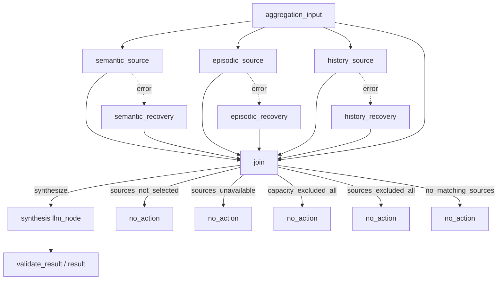

# #27 手动聚合实施规范

Part of #1。实施目标：[实现：workflow — 手动聚合 #27](https://github.com/nineofoursyrup/Agent-Alfred/issues/27)。

revision: AGGREGATION-SPEC-r1 | 2026-09-14 | ready-for-agent（规范就绪；发布状态见同一LOOP）

## Problem Statement

用户需要显式指定一个会话、聚合目标和资料来源，把语义记忆、情景记忆与该会话近期记录综合为草稿。目前没有这条完整用户路径。直接复用普通聊天准备与回退可能引入未选资料、额外模型调用或工具动作；空资料、局部故障、资料失效及保存失败若混为一种结果，又会生成空草稿或丢失真实故障与费用。

## Solution

在Behaviour页与CLI提供等价手动聚合入口，每次固定请求与目标Session。三来源在真实DAG中独立读取并汇合，按最终容量与来源许可决定无动作或一次primary模型起草，验证后将草稿交付到所选会话。来源故障可局部恢复；空资料零模型请求，资料失效和综合失败停止，不自动回退普通Agent。保留可恢复的运行与来源事实，草稿人工可见而不自动进入后续窗口或提炼。

本文是D4已整体批准设计的等义实施规范。以下Q1–Q15、R01–R10、F01–F08、CE-01–CE-16、公开接缝P1–P5全部内联；本文是后续实施与验收的单一权威合同，源设计及其快照仅保留批准历史。

## User Stories

1. As a CLI/Web用户, I want 显式选择目标会话、聚合目标、关键词与来源并发起生成, so that 本次草稿使用范围可控且不会自动发生。（R01/R09；Q1/Q2/Q10）
2. As a 用户, I want 多个来源分别读取、部分缺席或故障时如实降级, so that 可用资料仍能综合且故障不被隐藏。（R02/R06；Q4/Q11）
3. As a 用户, I want 仅用最终获准且可容纳的资料起草, so that 未选资料不被偷偷加入、空资料不会产生空草稿或模型费用。（R03/R10；Q3/Q6/Q7/Q11）
4. As a 用户, I want 资料失效、预算耗尽或生成失败时停止并保留真实费用, so that 系统不扩大我的起草授权或自动执行其它动作。（R04/R05；Q9/Q12）
5. As a 用户, I want 查看草稿、实际提供资料身份及明确的无动作/恢复原因, so that 能判断本次结果的依据与局限。（R05/R06；Q8/Q13/Q14）
6. As a 用户, I want 在原会话刷新或重启后恢复结果并区分未保存, so that 切换页面、响应丢失和记录故障不会造成改投或重复生成。（R01/R07；Q5/Q10/Q13）
7. As a 用户, I want 草稿不自动回流成来源且遗忘按真实使用关联生效, so that 模型推断不会被反复放大、被遗忘资料不会从新副本回流。（R07/R08；Q5/Q14）

## Implementation Decisions

### 批准来源与基线

- D1：2026-09-14，用户对Q1–Q4回复“全按建议”；D2：对Q5–Q10同样回复；D3：对Q11–Q15同样回复。
- D4：2026-09-14，用户对完整AGGREGATION-DESIGN-r4回复“确认”，批准Q1–Q15、R01–R10、F01–F08、CE-01–CE-16、P1–P5、CONTEXT及ADR-0038/0039。批准设计SHA-256：`282b0704c6e459050c6e3066492106a97296c10e4ce802e7e8c61adc1418a5cb`。
- AGGREGATION-DESIGN-r5仅补记D4，SHA-256：`10e2a557cdfc55eef3a6d9f13df0efbac88ec635d044fae2adcff70dc8da65de`。本规范未增加、删除、替换或豁免任何已确认要求及案例；Q2/Q4的“后续确定”改成指向后轮已确认的具体条款。
- 本地设计/规范工作树：`/Users/nineofour/Agent-Alfred-issue-27-design`，branch=`codex/27-manual-aggregation-design`；base/HEAD=`53a9041cfb22f85fd4f3bc10c264cda4c4179fe3`。本次远端main回读相同，已包含#26/PR#62；#27在规范准备时为OPEN，仅wayfinder:task、无评论。原主树的用户.gitignore改动未修改。
- 继承[#6裁决](https://github.com/nineofoursyrup/Agent-Alfred/issues/6#issuecomment-5429217158)、[GRAPH-SPEC-r1](https://github.com/nineofoursyrup/Agent-Alfred/blob/53a9041cfb22f85fd4f3bc10c264cda4c4179fe3/docs/design/issue-25-graph-spec.md)、[ROUTING-SPEC-r1](https://github.com/nineofoursyrup/Agent-Alfred/blob/53a9041cfb22f85fd4f3bc10c264cda4c4179fe3/docs/design/issue-26-message-routing-spec.md)、[SKILL-SPEC-r1](https://github.com/nineofoursyrup/Agent-Alfred/blob/53a9041cfb22f85fd4f3bc10c264cda4c4179fe3/docs/design/issue-24-skill-spec.md)。#25的后续协议修订优先于#6旧简写；#27的失败不回退由Q9/D2明确限定，不由旧通用回退语句反向覆盖。

### 领域词汇与ADR边界

沿[CONTEXT](https://github.com/nineofoursyrup/Agent-Alfred/blob/53a9041cfb22f85fd4f3bc10c264cda4c4179fe3/CONTEXT.md)区分Run、Step、Attempt、工作记忆、会话记录、运行转录、Graph、恢复、准入与记录状态。手动聚合是用户显式从选定来源取得资料并综合成草稿的工作流；聚合草稿是交付到指定会话的文本候选，生成不表示对外发送、执行或保存为长期记忆，也不自动成为后续窗口或提炼来源。

ADR-0010/0011/0012的单写者/波快照、能力缩减/受控工具与共享预算；ADR-0007的遗忘与历史保留；ADR-0019/0024/0026/0028/0029的记录屏障、准入与正文恢复；ADR-0032的真实工具计量继续适用。模型分类隔离和图/工具代际沿ADR-0036/0037，但本工作流不执行分类，也不把聚合专用工具加入普通聊天Registry。

新增ADR的决策在本规范中完整内联：

- **ADR-0038（Q5/D2）**：aggregation Run关联Session且可人工查看，工作窗口、聚合窗口与提炼仍只消费合格chat。若当作普通聊天，模型推断会反复成为后续依据；代价是purpose前向迁移及读写适配，后续聊天需用户明确引用草稿。
- **ADR-0039（Q9/D2）**：聚合失败不进入普通Agent，即使副作用为none也不回退；普通循环可能换资料或调用工具而突破起草范围。来源局部恢复和原传输重试保留，用户再生成是新Run，已有Attempt及费用保留。

### 已核验的接线缺口与本票责任

| 模块/接口边界 | 当前事实及本票责任 |
|---|---|
| runtime/work、admission、host与schema | 当前非chat不能关联Session且准入前要求模型capture/create；本票新增明确aggregation purpose与前向迁移，捕获配置或不可用状态，延迟client至有料分支，保持全局准入与不可变身份 |
| runtime/execution、工作窗口与memory输入追踪 | 既有chat前置会准备历史/Skill/gate；聚合只使用选中来源，通过独立生产路径及公开服务调用，复用安全许可与每Attempt输入证据，禁止隐式带入chat准备结果 |
| graph builder/registry/nodes、ToolRegistry | 编译冻结3来源/独享error/join/综合/互斥终点；聚合专用完整Registry与结构化受控结果，不能只隐藏schema或绕过计量/脱敏；fn_node保持纯计算 |
| memory Store/queries、ForgettingService、计量摘要 | 默认查询工具是页面式读取且可能文本截断；本票提供实际入模许可/版本身份、有界结构化数据、使用关联及受管摘要清理，不把页面可读等同自动可用 |
| recording、run/session queries、reply recovery | 当前人工会话路径多处仅接受chat；本票贯通aggregation的目标/草稿/NoAction、两轴状态、持久事实与单槽投影；保持窗口/提炼的chat过滤 |
| Behaviour、CLI、HTTP/SSE、MainBar | 显式表单/命令与共享校验，固定会话归属，不自动重投；候选不作为正式草稿流出，成功验证后一次交付；刷新/重启显示同一Run事实 |

模块名称描述职责，不强制照此新建同名文件。具体HTTP路由、CLI拼写与内部类型按项目惯例确定，不能改变F01–F08的行为与验收。旧冻结迁移不可原地改写；公开fault seams应保持最小且不可成为生产绕过接口。

### Q1 用户操作与交付位置

确认（D1）：在 Behaviour 页增加“手动聚合”表单，显式选择目标 Session、填写聚合目标、选择本次来源后生成；结果作为标明“聚合草稿”的回复进入所选 Session。CLI 提供等价显式命令。没有自动触发、持久启用开关、独立草稿管理器或 Graph 编辑器。Run类型及后续工作记忆/提炼资格见Q5/D2。

### Q2 首版来源与检索意图

确认（D1）：首版固定语义记忆、情景记忆、所选 Session 的最近完整问答窗口三个来源；每次可勾选，要求非空聚合目标，并以显式关键词查询两类记忆（可默认填目标，用户可改）。记忆可跨 Session，会话窗口仅来自所选 Session。不扩展网页、文件、日历、MCP 或跨会话记录搜索。数量、长度及查询零命中规则见已确认Q7/Q11及F02/F04。

### Q3 综合能力与草稿权限

确认（D1）：综合使用 primary 模型的单个 llm_node，基于已有来源生成文本草稿，不在综合阶段自行调用工具、补搜、修改长期记忆、写文件或发送消息。正常 Run 审计和已确认的回复存储另属系统收尾。Skill/人格见Q6/D2，引用见Q8/D2，失败回退见Q9/D2。

### Q4 空内容与故障的可见区别

确认（D1）：来源跳过、成功但零命中、读取失败分别留事实；仅非空有效资料参加综合。有资料且来源失败时生成草稿并显式显示降级及失败来源。无资料时不请求综合模型、不制造空草稿；全正常但空与含故障的无资料状态均走 no_action，后者保留 recoveries 并显示失败来源，不能伪装成“已成功检查且没有资料”。准确reason_code与终点拓扑见已确认Q11及F03/F04。

### Q5 会话关联与自动再利用

确认（D2）：新增明确的 aggregation Run 类型，关联用户选定 Session，成功时由唯一 finalizer 存本次目标消息与草稿；会话展示、正文恢复、运行详情支持该类型。自动工作窗口、后续聚合窗口与自动提炼仍只消费既有合格 chat，不自动纳入 aggregation，避免草稿反复成为自身的依据；用户可另发普通聊天引用或加工草稿。本票负责所需前向迁移及读写路径，不修改冻结旧迁移。无动作保留请求和 Run 事实、不造助手消息；失败/保存失败如实沿既有两轴状态显示。已确认 Q1 不预设其必须冒充 chat。

### Q6 综合输入与额外模型调用

确认（D2）：本工作流仅携当前聚合目标、固定起草指令、当前人格及最终获准资料，不额外带未勾选历史；不走消息分流、自动记忆检索门或 Skill 选择，也不继承此前 Skill。首版没有显式 Skill 控件；目标文本不作为聊天斜杠命令执行。正常业务只消耗一个综合 Step，适配器既有网络重试仍可有多个 Attempt，全部共享预算/总 deadline。零可用资料时整个工作流零模型请求；省略某来源应真的阻止其正文经隐式上下文进入请求。

### Q7 来源数量与容量

确认（D2）：复用现有设置，不新增聚合专属配置：两类记忆各按本库既有检索顺序，最多 per_store_limit（当前默认5）条、各 per_store_character_budget（默认4000）Unicode码点；预算计算含完整编码与来源元数据。只保留顺序内能容纳的完整条目，过长项整条排除并继续检查候选范围内后项，不追加翻页/模型补搜。会话最多 working_memory_rounds（默认20）个完整问答对。完整实际请求沿现有 input_character_limit（默认64000）计量；先按最旧问答对整组移除窗口，仍无法容纳目标/指令/人格和选中记忆则明确输入超限，零模型请求。

界面和持久事实区分未选、零命中、无获准来源、容量排除和故障；展示实际输入数量与可证明的排除/未取完状态，不以有限取样声称全库搜索完整。因每源容量全被排除而无料时无草稿并明确容量原因，不能显示为检索零命中。关键词沿现有 FTS语义，不跨库比较相关度，不做日期筛选或跨Session窗口。

### Q8 草稿的来源说明

确认（D2）：显示草稿及由程序从实际入模资料生成的“本次提供的资料”列表，资料使用本Run内稳定标识；提示模型在相关段落引用这些标识、区分事实/推断/建议及来源冲突。不以某库排名压过另一库，不把提供列表冒称为已逐句证实。正文引用不存在的标识或正文为空时拒绝作为成功草稿交付，保留失败/实耗，无自动再问模型修补。未引用的已提供资料仍可在输入说明查看；来源后续删除/隔离沿既有受管派生物规则处理，不能由复制快照绕过遗忘。

### Q9 综合或图失败后的回退

确认（D2）：聚合专用失败终止本次起草，不自动进入普通 Agent 循环；传输层已有重试仍按原策略，不追加第二次业务生成。来源普通故障按 Q4 恢复；控制流失败、综合失败/非法输出、输入证据失效、预算/总截止及取消各保留真实原因与已发生费用，无草稿就明确未生成。用户再次生成是新Run。此项明确限定 #6 的通用普通循环回退约定在 #27 的适用范围：普通循环可能忽略本次来源选择或执行起草之外的动作，与Q3冲突；已记录ADR-0039，不将变化藏在内部适配中。

### Q10 请求固定与重复触发

确认（D2）：每次提交冻结目标Session、目标、关键词和来源选择，获准时捕获模型/运行配置；打开表单不检索、不调用模型，实际资料由获准Run中的来源节点读取。请求提交后切换Session或修改表单不改投既有Run，结果只归属于原目标Session；Session失效时拒绝且保留表单。

同一页面待提交/运行时禁用生成；服务端继续使用全局准入与409、不排队。响应丢失不自动重投；先提示准入未确认并查看已有运行。首版不新增跨请求幂等键或内容去重保证：已完成后明确再次点击即新Run，可能再次计费；不能宣称任意网络重发都只执行一次。运行/保存期间的写入、记录失败关闭准入、重启不自动续跑均沿既有合同。

### Q11 真实读取、专用能力与唯一终点

确认（D3）：三个来源各由一个真实 tool_node 在图内读取。使用独立的聚合专用完整 ToolRegistry，只有三项 local_read 能力，复用全局计量存储、时钟、脱敏和截止时间；普通聊天 Registry 不注册它们，不能仅隐藏 schema 后仍让 routing.declarations 收进去。fn_node 保持纯计算，不通过闭包读取数据库。

聚合读取走可注入的公开来源服务，生产实现使用真实 Store/SQLite 与合格窗口筛选；最终数据含来源kind、id/version或原Run身份、完整内容与有界排除计数。聚合服务在有界候选内先检查自动消费许可，再按Q7整条裁剪；仅已知拒绝可作为排除，许可查询自身失败按Q12终止，不能冒充无来源。每库只读取既有检索顺序的前per_store_limit个候选，不为补满获准数追加翻页；实际漏取状态不明时标unknown，不制造总量。

为避免Registry 8,000字符文本摘要截断破坏JSON，增加窄的结构化工具结果接缝：图收到经过相同脱敏边界的完整有界结构化payload，计量/审计仍通过Registry；文本展示摘要可独立截断，不作为机器读取依据。结构、字段类型、条数与长度在来源节点提交写入前验证，失败走专属error，不能恢复半份JSON。此通道不是绕过ToolRegistry的callable；对现有工具的行为保持兼容。源普通失败保留稳定source/code，不回显未经脱敏的异常文本。

拓扑：aggregation_input纯锚点扇出三源且直连join；每源普通边与其专属error恢复节点普通边均连join，join等全部入边决议。源结果和恢复各自拥有唯一key，join对这些key全optional，对请求/锚点required。join检查选中源恰有成功或恢复事实，未选源两者皆缺；矛盾属于合同失败，不能当empty。

join唯一条件组互斥选择综合或无动作终点。综合→纯输出验证→唯一result；无动作分支不经过综合。reason优先级：sources_not_selected →（无有效资料且有来源故障）sources_unavailable → capacity_excluded_all → sources_excluded_all → no_matching_sources。这五个稳定码各有独立终点，优先码不丢逐来源详情；有资料的分支仍保留排除/故障说明。部分正常来源成功但空也是成功来源事实，不伪造skip。

图/专用工具在启动时编译并配对，结构不随本次勾选重编译；三个来源声明skippable_by_config并在执行时采用本次勾选。全跳过时join由锚点激活，综合级联skip，恰一no_action。消息分流开关、MCP目录发布不得将其换成其它图。模型配置有效性只在需要综合时成为必要条件；无料路径无需可用模型或密钥，有料而primary不可用则明确失败且不回退/换模型。正常Host基础存储不可用仍可拒绝准入，不宣称无依赖运行。

### Q12 选定资料失效时的停止边界

确认（D3）：各来源读取后生成不可变有来源的快照，沿每个真实Attempt的发送前屏障复核所选记忆id/version、历史许可、完整请求容量与同一绝对deadline；不宣称三个串行读取构成跨库同一事务快照。新增未选中资料不改变本Run，已选资料删除/隔离/改版、证据无法核验则整个Run失败，无后续网络请求，不临时去掉坏源再生成、不重搜替补。

来源普通IO/局部超时可error恢复；安全许可查询失败、发送前来源/证据错误、计量未确认、取消或总体deadline必须有可信强制停止身份，不能被普通error边包装成NoAction/CWR。本期沿已有取消/关闭能力，不新增取消UI；已在途网络行为不声称被撤回。重试前也复核，先前真实Attempt费用保留。使用关联依实际发送对账，prepared/not_sent与sent分开；回调被调用不作为已发请求的证明。

### Q13 结果验证、状态与持久恢复

确认（D3）：综合过程中只显示正在读取/正在起草等进度，模型候选不作为可交付草稿流入MainBar；待模型完成、纯验证通过，再一次交付完整草稿。保留真实流式Attempt与trace事实，不将抑制正式展示说成模型未流式。

引用使用保留格式[[S1]]（语义）、[[E1]]（情景）、[[H1]]（会话），编号按实际入模顺序确定；普通文本括号不算引用。要求所有双中括号引用符合此格式并指向本Run实际提供条目；空白正文、未知/非法保留引用失败。没有引用、未覆盖每句话不机械判失败，但提示模型标注且不宣称逐句证实。输出含工具请求等非草稿终结而无合法正文也失败；不执行输出里的工具请求。

持久Run事实保存图身份/类型、源选择和每源读取/入模/排除状态及可知计数、NoAction原因/恢复、失败及禁止回退原因、实际Attempt用量、reply_disposition，刷新/重启/trace裁剪后仍可读。对有效草稿已交付但记录失败，显示未保存并保留既有单槽投影，recording_pending期间409、recording_failed后503，不能自动再生成；重启后无法证明终态沿interrupted规则。失败不把诊断伪装成聚合草稿；NoAction只有状态和用户请求记录，无空助手消息。

### Q14 来源展示与后续遗忘

确认（D3）：唯一草稿正文是已交付的Session消息，不另建Behaviour最近草稿缓存或可复用来源正文副本；Behaviour展示引用同一Run读模型。程序生成的资料列表只持久化稳定本Run编号、来源种类、原id/version或Run身份与实际计数，不复制记忆主题/正文/摘录。标题用“语义资料S1”等固定文案，查看原资料走当前读取入口；原资料被删/不可读就显示不可用，不从旧摘录补回。

按每个真实Attempt登记memory_uses/history_reads，使aggregation参与既有遗忘传播。后续遗忘保留原始会话草稿及此前trace供人工查看（沿既有边界），受管工具摘要/缓存须失效或清理；aggregation仍按Q5不自动再用。资料清单证明当时实际提供的身份，不证明今天仍有效；不永久复制原文来承诺旧资料可打开。

### Q15 公开验收与外部替身

确认（D3）：验收必须从CLI显式命令和真实HTTP提交穿过Host/GraphRegistry/冻结业务图/三来源Registry/Store/SQLite/计量/Recorder，另验Behaviour浏览器与SSE/刷新/重启正文。禁止替换GraphResult、join、window-loader或finalizer伪造通过。

ScriptedModel替换模型响应，供应商HTTP可用本地受控传输验证实际发送/重试；时钟、ID及公开I/O阶段屏障可确定性控制。source服务公开依赖可注入抛错适配用于边界测试，但至少有一例在隔离临时SQLite中使语义读取真实失败（例如在公开连接工厂的authorizer拒绝其表SELECT），情景/会话仍成功，证明生产来源至error汇合的真实链路。结构非法与超长结果经受控源适配注入，专门验证结构化边界；不称其证明正常Store返回坏结构。

发送前变化用明确测试屏障连接真实Store更新/ForgettingService，不声称正常UI能够绕过Run持有的MutationGate；另以真实HTTP验证忙态写入被拒绝。验证实际发送为零或已发生次数、所有Step/Attempt/工具账、最终状态；付费模型和私人外部服务不作为默认必需验收，也不以脚本结果声称模型语义质量已证实。实现会话跑仓库适用检查，本设计会话全部NOT RUN。

### F01 请求、身份与准入（Q1/Q5/Q10/Q11）

- 请求必须携既有Session身份、非空聚合目标、显式关键词及三个来源的选择。选中任一记忆来源时关键词须非空；未选择任何来源是合法请求，不能由表单校验挡掉CE-02。目标与关键词用各自原语义，关键词不触发模型扩写/自动补搜。
- Web与CLI共用同一聚合提交服务及校验，用户目标作为用户消息保存；来源勾选/关键词另存为本次请求事实，不能伪装成用户说过的额外聊天内容。无效输入或失效Session在准入前拒绝，不创建虚假成功Run。
- 新Run `purpose=aggregation`可以关联Session；只有该明确类型扩展会话关联，probe/consolidation原限制不顺带放宽。Session标题等既有派生规则不靠伪造chat来满足；空会话中的聚合可显示既有回退标题，不新增标题规则。
- 准入冻结本次请求、人格与运行设置、图/专用Registry配对、primary配置快照或明确不可用状态；不可在执行时重捕当前模型/凭据设置或自动换模型。凭据只在既有内存快照，不进持久请求事实。
- 延迟建立模型客户端至综合确实需要它；无资料不需要可用primary，不伪造endpoint/model。基础存储、Host关闭、全局busy及记录故障仍按既有拒绝语义。
- 一次提交只运行aggregation图，忽略消息分流开关，不执行命令/gate/Skill选择，不自动排队或重复提交。仍是同一RunCoordinator/MutationGate，准入租约持有到记录落定。

### F02 三个来源与可信数据（Q2/Q4/Q7/Q11/Q12）

| 来源 | 读取与限量 | 最小身份 | 图输出key示意 |
|---|---|---|---|
| semantic | 关键词FTS、既有顺序前per_store_limit个候选；已知安全筛选；每库完整编码≤per_store_character_budget | kind/id/record_version | semantic_source |
| episodic | 同上，不新增日期筛选；原发生区间是资料的一部分 | kind/id/record_version | episodic_source |
| history | 指定Session的合格已完成chat完整问答、既有自动使用过滤，最多working_memory_rounds，按原时间顺序提供 | 原run_id/Session及完整来源组 | history_source |

三种结构化结果有版本、身份、完整内容、读取和排除的可知计数；结构校验在节点成功提交之前完成。memory内容含原subject/fact或summary/区间；history含完整问答，不拼接不同Run成一对。来源不得包含aggregation、intentional_no_reply、不完整/不安全历史；历史无Run条目仍按既有窗口规则排除，不以展示API绕过。

逐源区分selected、read_outcome（skipped/succeeded/failed/not_started）、候选数、获准数、源容量排除数、全请求裁剪数、actual_input_count、排除原因、稳定故障码。实际未知的数为unknown/null，不默认0。`not_started`用于强制终止前尚未执行者，不冒充配置跳过；`actual_input_count`在实际发送前应另区分prepared与sent，不把已准备称为已提供。

普通读取异常/局部超时只丢本源数据；稳定普通失败类别至少可分read_failed/local_timeout/invalid_source_result，不用异常自由文本驱动路由。取消、全局deadline、计量无法确认和输入许可/证据错误保留可信强制停止身份，越过局部恢复直接收尾。首版无来源采集自动重试；下一次显式生成才重新采集。每Attempt身份/许可复核属于安全校验，不是重新搜索或采集候补资料。

### F03 拓扑、写入与唯一终点（Q4/Q11）

这是设计说明图；产品拓扑唯一来源仍是编译图的describe()，不可把Mermaid当作产品第二份手写拓扑。图中N1–N5落地为不同静态身份、各自固定原因码。source节点各自拥有source key；恢复节点各自拥有recovery key，不回填/覆盖失败源的key。join来源/recovery keys都是optional，未出现就是缺键，不填None。join拥有唯一prepared_request/decision等合并结果，result拥有唯一draft output；名称可机械调整。

专属error目标不得配置skip、不得再有error边、不得共用。join等待全部入边决议后才运行，成功来源的已提交资料不被其它可恢复普通失败撤销。控制流/写集校验失败按GRAPH-SPEC-r1终止，不能借锚点遮盖。

### F04 先完成容量裁剪，再选择终点（Q4/Q7/Q8/Q11）

join阶段在最终路由前完成纯请求封装、实际input_characters计量、窗口整组裁剪、最终资料编号及输入清单。该纯逻辑可调用公开输入构造/计量函数，不做模型网络请求；不能将必要裁剪拖到llm已取得Step之后。

先检查目标/固定指令/人格的基础输入是否可容纳；基础输入本身超限为Failed(input_limit)，不谎报无来源。有效记忆经单库裁剪后固定；完整请求超限时逐个移除最旧完整问答，每次按实际序列化重算；仍超限为Failed(input_limit)。若裁剪使最后一份资料消失，则不得进入综合，按下表选择无动作。编号仅按最终请求的源内顺序分配S/E/H，从1开始连续；模型输入、验证器、显示列表共用同一份编号映射。

| 优先级/条件 | Graph结局 | 综合网络请求 | 可见事实 |
|---|---|---|---|
| 强制终止/输入不可信/基础或最终输入超限 | Failed或既有可信强制收尾；未恢复步耗尽为BudgetExhausted | 不发后续请求 | 准确失败/终止原因，不伪装无动作 |
| 最终资料非空、模型配置可用 | Completed；有源恢复则CompletedWithRecovery | 一个Step，Attempt按原传输策略 | 合法草稿；源故障/排除仍可见 |
| 最终资料非空、冻结的primary不可用 | Failed | 0 | 模型不可用，不换模型 |
| 最终资料空且全未选 | NoAction(sources_not_selected) | 0 | 未选择来源 |
| 最终资料空且有普通源故障 | NoAction(sources_unavailable, recoveries) | 0 | 来源故障及其它来源状态 |
| 最终资料空且有任一容量排除 | NoAction(capacity_excluded_all) | 0 | 容量导致无可用资料，保留其它排除 |
| 最终资料空且有自动使用排除 | NoAction(sources_excluded_all) | 0 | 无获准资料；不暴露被隔离正文 |
| 最终资料空且其余正常 | NoAction(no_matching_sources) | 0 | 本次有限查询/窗口无资料 |

上表后五项按顺序互斥归因，不丢每源事实。被已确认隔离/未知历史暂停规则排除的记录是可证明排除；许可服务本身报错是强制失败。NoAction可带恢复但没有output，不变成CompletedWithRecovery(empty)。没有资料的路径不为耗尽预算或使用模型而造Step；全Run截止/取消仍优先。

### F05 模型输入、发送与输出（Q3/Q6/Q8/Q9/Q12/Q13）

综合只消费F04冻结的非空请求；包括固定指令、获准人格、当前目标及实际资料，无工具schema、Skill、额外历史或检索门转录。原资料包装为带身份的数据，内含指令不升级成工具/系统权限；这里能机械证明输入与能力边界，不声称模型绝不会受文本影响。

每个Attempt发送前重验**最终请求实际包含**的记忆id/version与历史来源许可、完整请求计量、同一绝对deadline。已读但源限量/全请求裁剪排除者不入实际提供清单、不伪记使用；期间增加未选资料不改变请求。重验失败立即停止、不得修改冻结集合重试。底层传输重试共用同一Step lease、请求身份与总期限，真实Attempt全部对账。

保留引用语法严格为`[[S<n>]]`、`[[E<n>]]`、`[[H<n>]]`，n为无前导0的正整数且必须存在于本次映射。双中括号是保留记法，非法/未闭合标记失败；普通单括号、无引用的非空正文可通过机械验证。提示词要求相关引用并区分事实/推断/冲突，离线验收只证明结构和通路。

综合和验证产物在成功result之前是候选；MainBar/CLI正式草稿输出及正文恢复API不可提前把候选称成功。正常完成且非空、引用合法才一次交付；无效输出/模型错误/控制流错误不普通回退、不业务修补、不重复来源读取。保留原始Attempt/流式trace及费用，不将它们包装成正式助手消息。

### F06 持久事实与人工显示（Q1/Q5/Q10/Q13/Q14）

- aggregation纳入会话列表、消息查询、精确Run正文恢复及当前未记录投影；所有接口按原Session/Run身份，迟到响应不能改投当前标签页。Run列表同时保留purpose与Graph结局，不仅凭outcome=completed推导有草稿。
- 完成草稿时唯一finalizer保存一次用户目标与一次草稿；NoAction保存用户目标和Run事实、无助手；失败仅保留请求/失败事实及既有诊断，诊断不标聚合草稿。成功但未保存与业务失败分开。
- 聚合请求、source逐项状态、完整输入计量及排除、Graph schema/hash/结果/恢复、失败及fallback=blocked原因、actual-input身份列表、Step/Attempt/工具实耗和reply_disposition在记录成功后可离线回读，不依赖trace存在。
- 客户端pending只显示正在读取/起草；有效回复生成后的recording_pending显示正在保存；记录失败显示未保存，并沿现有准入关闭/投影/重启规则，不通过再次生成补救。
- 显示资料身份不复制记忆正文、subject/主题或摘录；原资料读入口按当前状态展示，不承诺旧版本正文仍可用。实际请求及前次trace的原有审计保留边界不扩大成新的缓存接口。
- 普通工作窗口、聚合窗口、提炼候选和提炼自动触发保持排除aggregation。用户手动复制/引用是新的显式输入，不承诺对用户自行重述文本做全域语义擦除。

### F07 实施责任与公共验证入口（Q5/Q11/Q15）

| 边界 | 实施责任 | 验证的真实组件 |
|---|---|---|
| P1 CLI与HTTP聚合提交 | 等价参数校验/Session身份/不可变请求；前向purpose迁移、准入捕获状态、延迟client | CLI命令解析、HTTP、Host、Coordinator、SQLite与RecordingStore |
| P2 aggregation graph注册/执行 | 冻结拓扑、独立3工具Registry、结构化结果、source独占key/error、join纯输入封装、synthesis/result | GraphBuilder/Registry/CompiledGraph、真实Node工厂、ToolRegistry/计量/中央脱敏 |
| P3 来源与发送屏障 | 真实Store和窗口许可筛选、限定候选/字符、最终身份冻结、Attempt来源复核与使用对账 | Store/SQLite、ForgettingService、实际ModelClient链及input evidence |
| P4 用户显示与收尾 | Behaviour提交与Run状态、MainBar草稿、SSE/正文恢复/刷新/重启、单一finalizer | 实际浏览器、HTTP/SSE、Run读模型、Recorder、投影和SQLite |
| P5 遗忘与后续来源 | 真实使用传播、受管摘要清理、原始历史保留、后续窗口/提炼排除 | 公开遗忘命令/范围确认、受管清理、窗口与提炼准备 |

允许替换：ScriptedModel、受控供应商HTTP、clock/ID、公开source依赖（专测结构/错误适配）、文件/记录/发送屏障。至少一次P2/P3源故障来自真实隔离SQLite查询失败；P3来源变化通过真实Store/Forgetting写入。为确定性故障使用的测试专属屏障不得成为生产安全绕过入口。禁止替换GraphResult、join、window-loader、核心调度、账本或finalizer制造成功。

### F08 需求与验收矩阵

| 要求 | 确认依据 | 必需案例 |
|---|---|---|
| R01 显式CLI/Web触发、目标会话与单次请求固定 | Q1/Q10 D1/D2 | CE-08、CE-14 |
| R02 三来源独立读写、可跳过与局部故障恢复 | #27、Q2/Q4/Q11 | CE-01/02/03/09/14 |
| R03 只从最终获准资料起草，空料无模型 | Q3/Q6/Q7/Q11 | CE-02/05/06/13/15 |
| R04 共享Step/Attempt/期限，失败不扩大动作 | Q3/Q6/Q9/Q12 | CE-07/10/16 |
| R05 使用身份和每Attempt来源复核 | Q8/Q12/Q14 | CE-10/12/16 |
| R06 合法草稿一次交付，NoAction与失败可分 | Q4/Q8/Q13 | CE-03/07/11/14 |
| R07 会话持久/正文恢复/记录两轴，聚合不自动再用 | Q5/Q10/Q13 | CE-04/08/11 |
| R08 遗忘边界与资料清单不复制正文 | Q5/Q14 | CE-04/12 |
| R09 真实入口、独立能力和结构化结果 | Q11/Q15 | CE-09/14 |
| R10 未配置模型仍可NoAction，启动固定图 | Q10/Q11 | CE-02/13/14 |

## Testing Decisions

测试以P1–P5公开行为与CE预期为准：输入/身份、实际模型请求、真实工具账、Graph结果与节点事实、SQLite终态、会话/正文API和用户可见状态。内部函数调用形状或仿照实现写出的期望不能代替行为验收。F07及Q15内联了允许替换和禁止替换的边界；源故障至少一次来自真实临时SQLite查询失败，不能全部用假来源结果证明。

现有测试先例（用于复用fixture/公开接缝，不表示它们已覆盖本票）：

- `src/agent_alfred/evals/deterministic/test_graph_compile.py`、`test_graph_nodes.py`、`test_graph_recording.py`：真实编译、节点和finalizer。
- `src/agent_alfred/evals/deterministic/test_message_routing.py`、`test_routing_input_safety.py`、`test_routing_behaviour.py`：Host/Graph/SQLite、无回复、输入隔离与Behaviour。
- `src/agent_alfred/evals/deterministic/test_runtime_working_memory.py`、`test_memory_input_attempts.py`、`test_forgetting.py`：完整窗口、真实Attempt发送证据及遗忘传播。
- `src/agent_alfred/evals/deterministic/test_durable_admission.py`、`test_recording_states.py`、`test_reply_recovery.py`：获准/记录两轴、受控真实SQLite提交屏障与正文恢复。
- Dashboard沿`package.json`的Playwright浏览器套件验证P4；必须有实际HTTP/SSE与浏览器路径，不能以仅调用DashboardApi的单元测试覆盖全部入口验收。

实施会话应完成新增CE与受影响回归，并运行仓库适用门禁。基线`.github/workflows/ci.yml`要求：`uv sync --extra dev --extra mcp --locked`后执行`uv run ruff check`、`uv run python scripts/check_skills.py`、`uv run python scripts/check_env_example.py`、`uv run --extra mcp pytest`、`uv build`、`uv run python scripts/check_mcp_installations.py --output /tmp/mcp-artifacts.json`；Dashboard按锁文件安装后执行`npm run typecheck`和`npm run test:browser`。具体环境准备沿该CI配置；后续项目检查变化时核验适用命令，不沿用旧PASS。requires_key/付费模型不是默认验收前置，脚本不能证明模型语义质量。

每个CE须映射到同一候选的命令、fixture/屏障、实际可观察断言与结果。当前只是规范综合，产品实现、离线/浏览器/模型/CI均NOT RUN；两轴NOT REVIEWED，无产品候选。文档源到规范逐项一致不等于产品验收通过。

## Critical Counterexamples

以下16个案例逐项继承D4批准源清单，ID和五项字段均保留。每例预期按同一规范的Q/F与R矩阵解释；设计确认和接缝确认不表示检查已经运行。

### CE-01 来源普通失败不吞掉成功来源

- **Basis:** #27 验收；#25 Q1/Q5。
- **Sequence:** A 成功取得资料，B 普通执行失败并由其专属 error 节点接管，C 成功；随后汇合及综合。
- **Expected behavior:** A/C 的资料保留并仅综合一次；B 候选写入不生效；结果 CompletedWithRecovery 携 B 的恢复记录。
- **Verification:** 真实生产业务图及 GraphRegistry/invoke、真实 Registry/SQLite；ScriptedModel 捕获综合输入。公开读取边界与确定性故障注入位置见Q11/Q15 / D3，不伪造 GraphResult。
- **Decision status:** confirmed #27/#25 + Q4/D1；公开接缝Q11/Q15由D3确认；运行NOT RUN。

### CE-02 全配置跳过不产生草稿

- **Basis:** #27 硬约束与验收。
- **Sequence:** 所有来源均被本次配置排除，运行同一冻结图。
- **Expected behavior:** 编译合法；来源配置 skip，综合级联 skip；恰一 no_action 终点，无 output/空助手消息，无综合模型调用。
- **Verification:** 真实生产图与公开提交入口、ScriptedModel 调用计数、节点事件及持久回复查询；入口已由Q1确认，观察路径见Q13/Q15 / D3。
- **Decision status:** confirmed #27/#25 + Q1/D1；持久观察Q13/Q15由D3确认；运行NOT RUN。

### CE-03 没有资料不等于成功查完

- **Basis:** Q4 / D1；#25 NoAction recoveries 合同。
- **Sequence:** 对照全部读取成功但零命中，与 A 失败而其他来源零命中/跳过。
- **Expected behavior:** 均无草稿和综合请求；后者具有恢复记录及可见失败来源，不能显示为正常查无资料。
- **Verification:** 真实来源边界、业务图、ScriptedModel、持久 Run/API 与用户界面；确定性失败控制见Q15/D3。
- **Decision status:** confirmed Q4/D1；公共验证接缝Q11/Q15由D3确认；运行NOT RUN。

### CE-04 草稿反馈成来源

- **Basis:** Q5/D2，Q1/D1。
- **Sequence:** 在Session A生成草稿G，再启动A的下一次聚合和一次自动提炼；另以普通chat显式讨论G。
- **Expected behavior:** G可在会话/正文恢复查看，但不自动进入聚合窗口、工作窗口或提炼；用户显式讨论形成的新chat按自身合格条件处理。
- **Verification:** 真实Host、SQLite、会话/正文API、窗口和提炼准备路径；ScriptedModel捕获后续请求，不mock window-loader。
- **Decision status:** confirmed Q5 / D2。

### CE-05 未勾选来源通过隐式上下文泄漏

- **Basis:** Q2/Q3 D1；Q6/D2。
- **Sequence:** A会话有历史与此前Skill，库中有记忆；仅勾选情景来源并执行聚合；对照全不勾选。
- **Expected behavior:** 首次只携获准情景资料、目标/固定指令/人格，零分类/gate/selector请求；全不勾选零模型请求，未选资料及Skill不入模。
- **Verification:** 真实提交/工作流/Graph/Registry，ScriptedModel完整请求与Attempt计数、真实来源调用计数。
- **Decision status:** confirmed Q6 / D2。

### CE-06 有查询结果但不能完整放入请求

- **Basis:** Q7/D2；Q4/D1。
- **Sequence:** 记忆候选首条超单库容量，后项可放；另全部超限；窗口超总容量；目标/人格等最小输入自身超限。
- **Expected behavior:** 整条/整组舍弃且记录准确原因，不截来源正文/问答配对；未取完与零命中分开；最小请求仍超限时明确失败且零模型请求，无空成功。
- **Verification:** 真实Store/窗口/编码计量与ScriptedModel发送屏障；边界长度使用完整实际请求计量。
- **Decision status:** confirmed Q7 / D2。

### CE-07 综合失败不能扩大授权

- **Basis:** Q3/D1；Q8/Q9/D2。
- **Sequence:** 来源可用，综合网络失败/空输出/引用不存在的资料编号；普通Assistant有可用写工具。
- **Expected behavior:** 不进入普通循环、不补搜/修复生成/调用写工具，不交付无效草稿；所有真实Attempt保留。传输重试与新增业务生成分开统计。
- **Verification:** 真实生产图/ModelClient装饰器/Registry/recording；ScriptedModel及可控传输故障；工具调用计数/数据库最终状态/正文API。
- **Decision status:** confirmed Q8/Q9 / D2。

### CE-08 提交后切会话及响应丢失

- **Basis:** Q1/D1；Q10/D2；ADR-0026/0028。
- **Sequence:** 向A提交，在返回202前切到B并编辑表单；另丢弃已获准请求的响应并刷新；Run到recording_pending期间再次提交。
- **Expected behavior:** 原结果只归A，无自动重投或改投；表单编辑只影响后续请求；保存期间409，响应丢失不撤销真实获准；完成后的新显式提交可产生新Run。
- **Verification:** 真实HTTP/Host/Recorder/SSE/浏览器，响应/提交屏障及真实SQLite；不伪造已获准快照。
- **Decision status:** confirmed Q10 / D2。

### CE-09 文本摘要截断与结构化源结果

- **Basis:** Q11/D3；Q4/D1。
- **Sequence:** 成功来源完整结构化payload超过文本展示摘要上限但在Q7许可内；另返回损坏结构/越限条数；另来源真实SQLite查询失败而其他来源成功。
- **Expected behavior:** 前者完整结构化数据可被图读取且摘要截断不损伤payload；坏结构在源提交前失败并恢复，不能冒充空数据/保留半份JSON；真实故障不重跑其它来源。
- **Verification:** Q15真实生产路径；独立Registry、真实计量/脱敏，公开源适配坏结果对照临时SQLite authorizer故障；普通聊天schemas/declarations不含聚合能力。
- **Decision status:** confirmed Q11/Q15 / D3。

### CE-10 发送前或重试前资料失效

- **Basis:** Q12/D3；Q6/Q9 D2；既有遗忘与真实Attempt约束。
- **Sequence:** 三来源读取后，在发送屏障更新/删除一条已选记忆或隔离历史；另在首Attempt真实失败后、重试前更改来源；对照只新增未选资料和HTTP忙态写入请求。
- **Expected behavior:** 已选失效后零后续请求，无重搜/替补/普通回退；只新增不影响快照；HTTP写入仍409；此前实耗保留，not_sent不伪装sent，无无动作/恢复成功掩盖安全停止。
- **Verification:** Q15；真实Store/Forgetting/Attempt输入账，受控发送屏障、时钟及供应商传输，检查实际网络计数和来源关联。
- **Decision status:** confirmed Q12/Q15 / D3。

### CE-11 部分模型输出、保存失败与恢复

- **Basis:** Q8/Q9 D2；Q13/D3。
- **Sequence:** 模型先流出文本后失败/产生未知引用；另完整合法草稿交付后阻塞或失败recording事务，再刷新/重启。
- **Expected behavior:** 未验证候选不成为正式草稿，失败实耗保留；合法草稿保存失败显示未保存，既有投影可恢复，保存未落定挡新Run，重启不伪造已记录成功。
- **Verification:** Q15真实浏览器/HTTP/SSE/Host/Recorder/SQLite，受控模型流与记录I/O屏障；同时观察正文、agent_log、Run两轴与工具/Attempt账。
- **Decision status:** confirmed Q13/Q15 / D3。

### CE-12 草稿使用关联与遗忘后的来源显示

- **Basis:** Q5/Q8 D2；Q14/D3。
- **Sequence:** 成功草稿实际使用记忆M及历史H；之后通过真实遗忘命令删除M并完成范围/受管清理，再看草稿资料清单和下一Run；对照仅prepared但未发送的来源。
- **Expected behavior:** 真实使用关联可传播隔离；原始会话草稿及既有trace仍人工可读，资料列表不得恢复被删正文/主题，原条目显示不可用；受管摘要已清理，aggregation不自动再用，未发送来源不伪记使用。
- **Verification:** 真实ForgettingService/公开删除与范围确认HTTP/SQLite/资料读入口/下一Run模型请求；检查受管清理与原始记录边界。
- **Decision status:** confirmed Q14/Q15 / D3。

### CE-13 无可用模型时仍可判定无资料

- **Basis:** Q4/D1、Q6/D2；Q11/D3。
- **Sequence:** primary未配置或不可用，分别全来源未选、全部查空、确有获准资料；对照Host基础记录不可用。
- **Expected behavior:** 前两者无网络请求并抵达准确NoAction；有料明确模型不可用，未产草稿且不换模型/普通回退；基础存储无法准入仍真实拒绝。
- **Verification:** 真实HTTP/CLI/Host/Registry/Graph/SQLite与未配置模型环境；检查NoAction终点、请求计数、Run/会话记录。
- **Decision status:** confirmed Q11/Q15 / D3。

### CE-14 正常与部分跳过的完整用户闭环

- **Basis:** #27验收；Q1–Q3/D1、Q5–Q8/D2、Q11/Q13/Q15/D3。
- **Sequence:** 通过Behaviour/HTTP及CLI分别提交三个来源全选、任意一个或两个来源选中；消息分流开/关作对照，比较describe/hash；用有限合法资料和带合法引用的ScriptedModel结果。
- **Expected behavior:** 每个选中来源的节点/采集调用恰执行一次，未选来源零采集且key缺席；发送前身份与许可复核不计为重新采集；compiled topology/hash不随勾选改变；恰一个综合Step/成功result且正常为Completed，无分流/gate/Skill/工具schema；准确资料清单及一次目标/草稿落库；普通聊天能力没有聚合专用工具；刷新/重启读到同一结果及源事实。
- **Verification:** P1–P4真实组件；ScriptedModel完整输入/Step/Attempt账；真实browser点击/CLI命令、工具调用计数、describe、SQLite/API及重启。输入不同组合不靠手工GraphResult。
- **Decision status:** confirmed #27、D1–D3；F01–F07等义整合；运行NOT RUN。

### CE-15 总请求裁剪后最后一项资料消失

- **Basis:** Q4/D1、Q6/Q7/D2、Q11/D3；F04。
- **Sequence:** 只勾选history，唯一合格问答完整编码使请求超过input_character_limit；基础目标/指令/人格自身可放。对照基础输入本身超限及另有可容纳记忆来源。
- **Expected behavior:** 路由前整组移除窗口；唯一资料移除后capacity_excluded_all、综合skip、0 Step/0 Attempt，不生成无资料草稿；基础自身超限明确Failed(input_limit)；仍有记忆则按真实最终请求生成且清单无被裁窗口。
- **Verification:** P1–P4；真实窗口/输入序列化/图路由与ScriptedModel发送计数；检查NoAction/Failed区别、节点事件、记录与排除计数。
- **Decision status:** confirmed Q4/Q6/Q7/Q11；F04是已确认合同的必要顺序；运行NOT RUN。

### CE-16 Step耗尽、局部与整体停止、真实重试

- **Basis:** Q6/Q9/D2、Q12/Q15/D3；GRAPH-SPEC-r1预算/强制收尾。
- **Sequence:** 有料且预算0；全未选且预算0；预算1综合首Attempt可重试失败后成功；源局部读取超时且其它源可用；读取中达到Run总deadline/既有取消，另工具计量失败。
- **Expected behavior:** 有料预算不足0网络，准确耗尽；全未选且未被取消/总超时可0 Step NoAction；重试共用一个Step/总deadline，实际费用全保留；局部故障可恢复且该源采集调用只执行一次，发送前身份/许可复核不计为重新采集；总截止/取消/计量不明强制停止，后续节点/网络不执行，不改写成CWR或NoAction，不普通回退。
- **Verification:** P1–P4；受控clock/取消入口/真实ToolRegistry计量失败及本地模型传输，检查真实Attempt数量、来源调用计数、逐节点状态和最终Run记录；不以sleep时序猜测。
- **Decision status:** confirmed Q6/Q9/Q12/Q15；运行NOT RUN。

## Readiness and Open Decisions

- **AGGREGATION-SPEC-r1：ready-for-agent。** D4已整体批准设计与必要公开接缝；R01–R10、Q1–Q15、F01–F08、P1–P5及CE-01–CE-16全部保留，精确预期已内联。未决产品决定、必需延期案例、验收合同阻塞均为none。
- 本次to-spec没有新增、删除、替换或豁免已确认合同；只按模板组织、内联来源和补入现有测试/检查命令。源到规范逐项比对保存在同一LOOP的spec-r1核验入口。
- 规范就绪与发布状态分开：完整正文已准备，目标为已有#27，保留wayfinder:task并准备添加ready-for-agent。用户已明确确认将完整规范写入现有#27正文并添加ready-for-agent；实际发布结果以同一LOOP的远端回读证据为准；就绪标记不是产品实现或Git交付授权。
- 若实施发现真实不可满足的冲突，应保留合同并提交最小决策差异，不自行删例、改为通过或用普通Agent回退规避。

## Out of Scope

- 自动触发/启用开关、通用Graph编辑器或选图器、独立草稿管理页面与正文缓存。（Q1/D1、Q14/D3）
- 新增网页/文件/日历/MCP来源、跨Session历史搜索、日期筛选、追加翻页/模型补搜、跨库比较相关度。（Q2/D1、Q7/D2、Q11/D3）
- 自动Skill/记忆检索门/消息分流、继承旧Skill、新Skill控件或把目标斜杠文本执行为命令。（Q6/D2）
- 自动长期保存、写文件、发送、综合阶段工具调用；聚合草稿自动进入工作窗口、聚合窗口或提炼。（Q3/D1、Q5/D2）
- 普通Agent回退、额外业务修补模型调用、源采集自动重试；原传输重试与发送前安全复核不在此排除之内。（Q9/D2、Q11/Q12/D3、F02）
- 跨请求幂等或内容去重、自动重投、额外取消UI。（Q10/D2、Q12/D3）
- 付费模型/私人外部服务作为默认验收要求，或以脚本声称已经证明模型语义质量。（Q15/D3）
- 借to-spec启动产品实现、认领、commit/push、PR、merge或关闭#27；远端规范发布按其独立最终授权与回读执行。

purpose前向迁移、完整CLI/Web入口、结构化只读能力、公开验证与来源安全均在本票范围，不能以“仅搭一张图”为由省略（D4）。

## Further Notes

### 单一权威与来源保全

后续实施与验收只维护本文AGGREGATION-SPEC-r1；AGGREGATION-DESIGN-r5、D4批准的r4四文件快照与批准记录保留为历史来源，不并行演化验收定义。本文已内联新词汇、ADR-0038/0039决定及全部CE，不需要访问本地聊天或未发布companion才能理解实施合同。落实实现时仍应一并交付已经批准的CONTEXT和ADR文档变更。

批准快照：`/Users/nineofour/Agent-Alfred-issue-27-design/tmp/agent-work/issue-27/design-r4/manifest.json`；D4原文及hash绑定：同目录上一层`design-approval-d4.json`。这些是批准证据，不是另一份可写的实施规范。

### 实施与发布交接

唯一任务入口：`/Users/nineofour/Agent-Alfred-issue-27-design/tmp/agent-work/issue-27/LOOP.md`，本次发布交接revision 8；接续必须先读最新revision并核验规范hash、Git状态、授权及在途操作。当前规范路径：`/Users/nineofour/Agent-Alfred-issue-27-design/docs/design/issue-27-manual-aggregation-spec.md`。

目标是已有#27，保持其身份、标题及wayfinder:task，不创建重复施工票。用户已明确授权将完整规范写入正文并添加ready-for-agent；发布前再次读取旧正文/标签，发布后逐字比较正文与本文件、回读标签与状态。正文与标签任一步失败都需按真实状态记录，不将部分成功说成已完成。

下一实施负责人未指派；取得实现授权后使用归属明确的隔离工作树，把16项CE映射到同一候选的真实检查证据。规范ready-for-agent不代表任何测试已通过，也不扩大为Git发布或Issue关闭授权。
