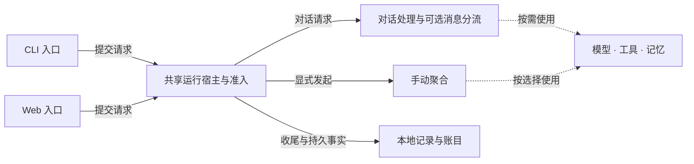

# Overview 内容与数据合同

设计身份：**OVERVIEW-DATA-DESIGN-r1**。日期：2026-10-08（Asia/Shanghai）。

状态：**Q1–Q9 已经两轮 live exchange 确认；产品尚未实施，行为验收尚未执行。** 本文整合已确认选择及其必要边界，不追加平均延迟、检索门调用率、实时执行图或新的业务能力。确认依据见 [APPROVAL.md](APPROVAL.md)，推荐原意见 [DECISIONS.md](DECISIONS.md)，代码依据见 [FACTS.md](FACTS.md)。

适用于 [#88](https://github.com/nineofoursyrup/Agent-Alfred/issues/88)，承接 [#85](https://github.com/nineofoursyrup/Agent-Alfred/issues/85)、[#86 视觉基线](../issue-86/DECISIONS.md)与 [#87 壳层规格](../issue-87/SPEC.md)。本文冻结总览内容、读侧含义与可见行为；具体 HTTP 路由和代码组织在后续实施规格中落实，不在本票实现 API、迁移数据或运行模型。

## D01：页面职责与内容

依据：Q1–Q4，父地图 Q4、Q7。

`/overview` 按「三张指标卡 → 静态架构说明 → 最近运行」排列。卡片为运行记录数、模型费用、当前记忆条目数；各卡保留到原有详情的入口。三个指标分别描述活动记录、已记录模型消耗和保存库存，均不代表模型质量、成功率或发布验收。

- 不显示没有统一持久事实的平均延迟，不将图执行时长改名端到端延迟。
- 不把检索跳过率、命中率、错误率或路由统计改名为检索门模型调用率；相关既有统计继续在原页面查看。
- Overview 不呈现正式回复、请求摘要、思考正文、工具参数／结果或记忆正文。MainBar 继续由壳层管理，保留本标签页所选 Session。
- 数字来自完整声明范围；样例、默认占位数、第一页长度均不得成为真实指标。加载与不可用状态使用文字及占位符，不能填零。

## D02：三个数据区及来源身份

依据：Q5、Q7、Q8，[ADR-0047](../../adr/0047-overview-preserves-source-snapshot-boundaries.md)。

| 数据区 | 一致性范围 | 来源与身份 | 页面显示 |
| --- | --- | --- | --- |
| 运行记录数＋模型费用 | 同一完整账目成员集合、同次价格解释 | 持久 Run／Attempt 账目；同一个 accounting snapshot 与 `process_instance_id`，携带规范化期间、计算时刻、价格身份和有效期 | 共用期间与来源说明，两张卡同时换入新快照 |
| 当前记忆条目数 | 同一次读取的语义＋情景库存 | 当前 Store；同一个 `memory_revision`、`process_instance_id` 与读取身份 | 标为「当前存量」，显示读取时刻 |
| 最近运行 | 一次持久列表读取；另叠加可定位的当前 Run 状态 | Run 索引读取身份与时刻；壳层当前实例／状态修订 | 标为「全历史最近运行」；当前槽明确区分实时通知与离线最后观测 |

页面显示每区自己的来源名称、计算／读取时间和当前状态。运行数与费用来源相同可共用一处说明；不能用最后一个成功区的时间标记整页「已更新」。技术身份可放在可展开的来源说明，不占据主读数。

`seq`、`activity_revision`、`state_revision`、`memory_revision` 各有原有职责，禁止跨种类比较大小。进程身份变化使旧来源身份失效；重新连接同一持久库之后，历史 Run 仍存在，不因新进程而把历史计数清零。

## D03：统计范围、自然日与时区

依据：Q5。

1. 运行记录数与模型费用覆盖当前连接所对应本地持久库内的全部 Session、全部用途、全部准入状态与全部结局；包含 chat、aggregation、系统运行及未知用途。未关联 Run 的旧消息不伪造为 Run。
2. 首次进入默认 `7d`，即包括当天在内的七个自然日；提供 `today`、`7d`、`30d` 三个选择。自定义日期、全部历史、会话与用途筛选继续在原详情页使用，不扩展为总览分析面板。
3. 时区取浏览器提供的有效 IANA 标识，明确显示；当前用户的时区为 `Asia/Shanghai`。不硬编码用户时区，不静默以 UTC 替代无效时区。无效或无法确认时区时，期间区显示范围不可用及可修正原因，其他区仍可读取。
4. 用服务端认可的时区和日期构造半开区间 `[start, end)`：起始日当地零时至结束日次日零时，再转换为确定的时间点。自然日不写成固定 24 小时倍数。
5. Run 的归属时间沿用 Ops：有 `started_at` 时用开始时间，否则用 `accepted_at`。Run 的全部已记录 Attempt 消耗随该 Run 归入同一期间，不声称是按扣费发生日分摊的供应商账单。
6. 某 Run 在第一份快照中尚未开始，之后跨日开始，新的期间归属可以变化；旧快照不被改写。已经开始的 Run 跨午夜结束，其费用仍按开始时间归属。
7. 每次进入、用户改变期间或手动刷新期间区时，根据本次时间固定实际起止、时区和计算时刻。跨午夜不自动滚动已显示的成员集合；标题保留实际日期范围，下一次显式刷新才重算相对窗口。
8. 记忆库存不受期间选择影响；最近运行仍是全历史最近五条。切换期间只要求重读期间区；全页刷新分别请求三个区，单区重试只处理该区。

非正文的期间和时区选择可按 #87 的导航规则恢复；业务结果不写入 URL、通用页面缓存或持久浏览器存储。带无效期间的入口明确显示范围错误，不能悄悄呈现另一范围的数字。

## D04：运行记录数与模型费用

依据：Q1、Q5、Q6。

### 运行记录数

`C` 是本快照中可确认归入期间的不同 Run 记录数，单位「条 Run 记录」。包含未获准、准入未确认、未完成和失败记录，因此名称保持为运行记录数；不显示为已执行数、成功数或会话数。

`U` 是因归属时间缺失／损坏、无法判断是否进入期间的记录数。`U > 0` 时显示「已定位 C 条；另 U 条期间无法判定」，不称 C 为完整总量，也不把 C＋U 当成确定的期间总数。仅当读取完整、`C = 0` 且 `U = 0` 时显示「暂无运行记录」。

分页只影响明细。数百条匹配记录必须全部参与汇总；资源限制、超时或读取故障不能以返回首页计数冒充成功。不能证明完整集合时，区级读取失败；已有可信旧值按 D08 处理。

### 模型费用与覆盖

沿用既有计费投影，将每个持久 Attempt 判为 exact、estimated 或 unknown。失败、重试、流式回退和 aborted Attempt 的实际用量照常计账；不只数最终 committed Attempt。

| 内容 | 合同 |
| --- | --- |
| 精确金额 | exact 分项的 USD 合计，来源说明为端点报告；不扩写为外部账单已经核对 |
| 估算金额 | estimated 分项的 USD 合计，与精确金额分列；来源说明保留实际价格来源，混合来源或含 stale 价格时可见 |
| 费用未知 | 已记录 Attempt 中 unknown 的次数；说明中同时提供已记录 Attempt 数，不能假称这是全部实际调用数 |
| 账目覆盖不足 | 按来源给出不完整 Run 数及原因类别；与费用未知次数、期间归属未知分别显示 |
| 工具计量 | 不加入模型 USD；用量账本入口用于查看服务／单位分列的计量 |

可以显示精确 USD 0.12、估算 USD 0.03、两次费用未知，但不能简称为「总费用 USD 0.15」。本页不新增覆盖率百分比，不用 Run 记录数作为 Attempt 的分母；不完整事实未知的调用次数仍然是未知。

全部已知调用费用为 unknown、或缺少足够模型账目而无可确认金额时，主状态为「费用未知」，不能因为合计器起始值为零就显示零费用。完整集合为空时显示「暂无运行记录」。证明该范围没有模型消耗、或所发生模型消耗金额为零，且模型账目与期间没有未解释缺口时，才可表达该范围零费用。已有 `incomplete_runs` 可能包含历史工具计量缺口，不能把它直接改名为「模型费用未知 Run 数」；模型与工具的证明范围保持分开。

金额保留十进制依据，不做汇率转换。摘要格式不得把微小正金额四舍五入成确定零；低于摘要显示精度时用小于阈值的表示，并在本次来源说明中保留精确十进制值。读取使用现成的有效价格依据，不通过总览刷新触发模型试跑、付费探测或填造单价。刷新后价格变化可以改变估算值，计算时刻与价格身份随本次结果更新。

trace 缺失、裁剪或详细路径不可用，不自动删除仍然存在的 Run 和模型账目。trace 不完整也不能单独证明模型账目缺失；反过来，账目存在不能证明 trace 完整。

## D05：当前记忆条目数

依据：Q1、Q7。

- 分别显示当前保存的语义记忆与情景记忆数量，单位「条」，每个 MemoryId 的当前条目计一次。
- 包含受人工修改保护的现存条目；不包含已删除条目、待批准提炼候选、旧版本、镜像副本、会话消息或程序性 Skill 文件。
- 不声称所有已保存条目均可用于自动输入。条目删除后数量减少，也不证明来源隔离、范围确认或受管清理已全部完成；遗忘状态仍去 Memory 查看。
- 两类计数必须来自完整集合并绑定同一持久 `memory_revision`。不得先数一类，再将另一次修订下的另一类拼接进来；分页中途修订变化不能被当成完成全量计数。
- 支持完整计数的源返回非负整数；没有相应能力、读取失败或无法绑定一致修订时，整个记忆区明确不可用。不能以第一页长度、镜像文件数或过往计数作替代。
- 语义与情景均确认为零时显示「尚无已保存的语义／情景记忆」。缺少某类证据不等于该类为零。

## D06：最近运行与当前槽

依据：Q3、Q4、Q8，以及 Run、准入与记录状态的既有定义。

持久列表读取全实例、全用途、全历史最近 **5 条已结束 Run**，按 `(activity_revision, run_id)` 降序；不足五条如实显示。无更多分页控件，提供「查看全部运行」入口。这是有意截取的最近活动摘要，其长度不得参与指标卡计数。

没有可展示的终态记录时显示「暂无可展示的已结束运行」，不推断全实例没有记录；正在运行或记录服务故障的全局状态仍保留。期间计数与最近列表的范围、时间和可定位性规则不同，两者不要求数值相等。

当前运行以及尚未保存的终态使用壳层已有权威状态单独置顶，至多一个当前槽。按完整 Run ID 去重，同一条不能同时出现在当前槽和持久列表中；需要补足五条时由读侧提供足量终态候选，不让客户端扫描历史正文。

| 可见字段 | 来源与判读 |
| --- | --- |
| 类型 | Run purpose；已知用途使用现有中文名称，未知用途保留安全文本并标明未知 |
| 时间 | 持久记录展示「受理时间」；当前槽使用权威状态已提供的开始时间并明确名称，缺失显示未知，不伪造时间。列表排序仍只用活动序号 |
| 入口 | 既有 gateway／entry surface 的安全显示值；未知时保留未知，不推断新渠道 |
| 短 Run ID | 只缩短显示；链接绑定完整不透明 ID，必要时扩展显示以区分碰撞，不能解析 ID 推断时间 |
| 阶段／结局 | accepted、running 与 finished 的阶段按既有领域表达；已完成、受控停止、失败、中断的含义保持原样。已知无回复结局不标成生成了回复 |
| 记录状态 | 独立展示正在保存、已保存、未保存；没有可证明事实时为「记录状态未知」，不是增加第四种持久 recording_state |
| 准入缺口 | 已有未获准／准入未确认等事实保留为标记，不从出现于总览推断已获准 |

`run.finished` 通知和 `phase=finished` 不能证明 `recorded`。持久已保存标记沿用既有 Run evidence 对收尾提交的判据，通过无正文元数据提供；运行中与同进程未保存终态沿用 Host 已确认状态。持久证据缺失／损坏或来源互相矛盾时明确未知／不可用，不能选择一个漂亮的终态。已经可证明已保存的事实不得被同 Run 的旧 pending 响应降级。

不为总览的五条徽标逐条加载 trace、正式回复或工具正文。重启恢复为 interrupted 但缺少收尾证据的记录，仍可显示「终态无法确认 · 记录状态未知」，不能从恢复后的 finished 推断正常完成或保存成功。既有无法提供 Web 详情的交接失败形态，继续由全局记录服务状态说明，不能制造可点击的虚构 Run 卡。

列表保持本次读取结果；新的持久终态到来只提示「有新运行，刷新查看」。当前槽按实时通知更新，记录落定且宿主释放该槽后移除；其对应新历史记录在显式刷新后进入持久列表。断连后当前槽停止实时断言，保留最后观测并标明断连，不将断连推断成业务失败。

## D07：静态架构说明与页面入口

依据：Q2。标题固定为「静态架构说明」，说明文字为「本版本的组件关系；不表示当前配置可用性或某次运行的执行路径」。箭头表示入口／依赖关系，没有运行高亮、定时动画、进度或成败颜色。

图是组件关系概括；可选分流、检索门与工具不是每条 Run 必经的固定直线。记忆准备可能位于图调用之前；手动聚合是显式 workflow；单个 Graph 的声明去 Behaviour，某次执行证据去 Run 详情。组件存在不证明当前已经配置、连接、授权或执行。

| 说明内容 | 对应入口 |
| --- | --- |
| CLI／Web 与共享运行宿主 | 说明文本；运行活动入口 `/runs?filter=all`；不启动 CLI，不创建 Session |
| 对话处理、可选消息分流、手动聚合 | `/behaviour`，只导航，不触发配置变更或聚合 |
| 模型与端点 | `/models`、`/connections`，不自动探测或试跑 |
| 工具 | `/tools`，不自动授权或执行 |
| 语义／情景记忆 | `/memory`；Skill 文件与其条目计数的区别在说明中保留 |
| 持久记录与模型／工具计量 | `/runs?filter=all`、`/ops`；数据库诊断入口可用现有 `/database`，不自动执行 SQL |

不从参考稿加入 voice、未实现消息渠道或日历集成；存在日程数据结构不等于已提供外部日历能力。纯说明节点不伪装成可操作按钮。图读不到业务数据时仍可展示本版本说明，与业务区的错误分别表达。

## D08：加载、旧值、失效与重连

依据：Q4、Q8。每区保存本次来源身份、读取请求身份、阶段和新鲜度；状态可以并列，例如「刷新失败 · 显示 10:20 的过期快照」。unknown 描述事实缺口，过期描述观察时效，断连描述连接，不能互相覆盖。

| 触发 | 必须表现 |
| --- | --- |
| 首次进入 | 在已核验的实例身份下读取一次；各区独立加载，不出现默认零。无已选 Session 仍可读取总览 |
| 同范围手动刷新 | 旧值可保留但标明正在刷新与原时间；期间两卡成功后同批替换；失败标明失败，不能更新旧值的时间冒充成功 |
| 一个区首次读取失败 | 该区显示失败／不可用及重试；其余区继续显示自己的有效结果，不整页报空 |
| 改变期间 | 立即撤销期间区旧值，明确新范围正在加载；记忆与最近运行的范围不变 |
| 普通新数据通知 | 利用同一壳层连接提示待刷新，不从事件累加金额或猜测完整计数，不启动定时轮询 |
| 记忆修订推进 | 立即撤销旧的当前计数，拒绝在旧修订启动或返回的响应；提示重新读取，不以旧数量继续充当当前值 |
| 连接中断 | 同实例、同范围的非正文旧值可保留为离线副本；当前槽保留最后观测并撤销实时标志；中断前请求失去更新当前值的资格 |
| 同实例重连 | 先恢复既有连接／身份与记忆修订核验；不能仅凭连接恢复将旧内容重新标为新鲜，内容由用户刷新 |
| 新进程身份 | 撤销全部旧数据区及旧请求；保留安全的期间选择和独立 MainBar 草稿规则，等待在新身份下的用户刷新 |
| 满十五分钟或来源更早失效 | 标记过期；可保留已加载的非正文旧副本，不能冒充最新值或继续使用失效的读取句柄 |
| 离开页面或新请求取代旧请求 | 撤销所属读取、释放所属临时资源；迟到响应不得修改其他页面、旧范围或新实例，也不能夺取焦点 |

十五分钟从各区本次成功的源观察时刻计，不因重连、重渲染、切换布局、打开抽屉或一次失败重置。源明示更短的有效期／失效则从早；事件丢失或 replay gap 只能降低可信新鲜度，不能按“没看到变化”推断没有变化。已经退休的请求在同实例重连后也不能复活。

没有业务轮询；本地时效提示计时不是取数。首页进入、用户范围变更、全页刷新和单区重试是有限的读取触发；实例／修订核验仍属于既有壳层协议。修订竞争的内部有限重读应遵循既有 Memory 读取边界，不能成为后台无限重试。

面板隐藏或窄屏主对话展开不等于离页，失效处理继续工作；重新显示中央页不能恢复已撤销的数据。当前槽采用实时状态协议，不把持久列表的十五分钟静态时效误套成它的运行时长限制。

## D09：从摘要进入原有详情

依据：Q9，#87。

| 总览入口 | 目标与上下文 | 用户必须能理解的差异 |
| --- | --- | --- |
| 查看全部运行 | `/runs?filter=all` | 目标是全部运行列表，不沿用总览期间，不称为「本期 C 条明细」 |
| 查看本期账目 | `/ops`，使用已有 `range=custom`、`start`、`end`、`timezone` 预填固定日期边界 | 目标重新创建账目快照；明确「按原期间重新读取」，金额可能因新增记录或价格变化而改变 |
| 查看当前记忆 | `/memory` | 目标重新读取当前条目，不承诺仍与旧总览数量相同 |
| 查看某次运行 | `/runs/<编码后的完整 run_id>` | 进入过程详情，保留 MainBar 所选 Session、草稿和唯一连接 |

费用跳转携带原快照的固定日期边界和时区，不仅传 `range=7d`；午夜之后仍可复现原来的期间选择。目标页以新来源身份、新计算时刻呈现；总览中旧金额的来源说明仍是当次读数，不能被导航动作倒写。期间区尚无有效范围时，不生成伪造的「本期」链接，可提供明确的普通用量账本入口。

既有 Run 消失、不可定位或读取失败时，保留其原有错误语义，不静默跳到另一个 Run／Session。所有链接服从 #87 的导航、返回、焦点、未保存输入保护和窄屏规则；不自动发送、继续会话、重跑业务、保存设置或发起模型／工具操作。

## D10：后续实现需要的最小读取补充

本节是合同，不表示这些 API 已存在。复用领域读侧和原有保护，产品实现另行授权。

1. **期间摘要**：复用完整账目聚合与价格解释，返回运行数、精确／估算分项、已记录 Attempt 数、费用未知次数、覆盖不足原因、期间归属未知数量、来源／价格身份和时间。不从 `/api/runs` 分页拼总数，不增加独立永久账本。
2. **记忆库存**：补充语义／情景完整 count 及同一 `memory_revision`，只返回数量和来源元数据；不能为了计数把全部记忆正文运到浏览器。替代 Store 若无法证明完整同修订计数，按 D05 不可用处理。
3. **最近运行摘要**：复用现有列表排序、可定位性、准入与生命周期，补齐可证明的记录状态及必要显示标记；只取元数据，不扫描 trace 或完整回复。当前槽由既有壳层权威状态提供。
4. **时序及错误信封**：各区可辨认成功、空、失败和事实缺口，响应绑定当前实例、范围／修订和请求身份；客户端按 D08 拒绝旧响应。无法确认完整集合的来源不能以截断成功响应替代错误。
5. **资源所有权**：总览读取拥有的临时聚合和请求在完成、取消、离页或被替代时有界释放；不得连续进入几次就占满 Ops 的八份保留快照，也不得删除其他页面仍在使用的快照。逻辑读数身份不等于承诺服务器永久保留可再取的明细句柄；临时资源释放不改写已取得的数值事实，后续有效性按明确返回的合同与 D08 处理。
6. **领域与权限边界**：沿用同源 Dashboard、现有读取保护、Redactor 与安全文本呈现；允许复用现有通过 POST 创建临时只读快照的方式，但不触发业务写入、数据迁移、模型调用、外部探测或新的 EventSource。

只在来源完整性、时间／修订绑定或现有接口无法满足上述合同的地方补读侧能力；不以“直接复用 API”为由遗漏状态，也不为这三张卡重写业务生命周期。未来若希望加入平均延迟、检索门模型调用率或实时图，须另行裁定事实定义与范围，不从本设计推得许可。

## 关键反例与后续验收

以下是实现后的验证义务，**本轮未执行产品验收**。优先复用已有行为测试，按独立失效方式补充覆盖，不以用例数量证明完成。

| ID | 场景 | 必须观察到的结果 |
| --- | --- | --- |
| CE-01 | 期间内有超过 50 条 Run，Memory 超过 100 条；明细只加载第一页 | 运行与记忆指标仍来自完整集合；最近列表有意只取五条，三者不混用分母 |
| CE-02 | Run 在午夜前受理、午夜后开始；另一个 Run 开始后跨日结束；改变 IANA 时区 | 各快照按 D03 的开始／受理回退及自然日归属；无按费用发生日拆分，无旧快照改写 |
| CE-03 | 时间可判定 Run 为零，但有两条归属时间损坏 | 显示已定位零条及两条期间未知；不显示“暂无运行”或确定零费用 |
| CE-04 | exact、estimated、unknown 混合，含一次 aborted Attempt 和一个工具 credits 记录 | 模型两金额分列、未知与覆盖可见；aborted 计账，工具计量不与 USD 合并 |
| CE-05 | 全部费用未知、完整账目无模型调用、完整零费用、微小正金额四种输入 | 四者语义可区分；微小正金额不显示为确定零；工具缺口不被重命名为模型费用未知 |
| CE-06 | 删除已封存 trace，保留 Run、telemetry 与工具计量 | 仍可读取已有运行及账目；不靠 trace 补延迟或改写结局，不伪造已保存 |
| CE-07 | 删除一条记忆但遗忘清理未完成；计数读取期间修订推进；存在受保护条目与候选 | 只数当前保存条目；删除计数与清理结果分别表达；不拼接两个修订，不计候选／副本 |
| CE-08 | 同一 Run 从 running 到 finished/pending，再到 recorded；列表读取与状态通知交错 | 一条 Run 至多出现一次；结局与保存状态独立；旧 pending 不覆盖已确认 recorded |
| CE-09 | 重启恢复的 interrupted 没有终态 telemetry；交接失败形态不可导航 | 保留证据不足的状态；不从 finished 推断已保存，不制造无目标的当前 Run 链接 |
| CE-10 | 仅记忆区失败，或期间区刷新失败；随后切换期间 | 局部失败不清空其他区；同范围旧值有标记；新范围不继承旧期间数字或时间 |
| CE-11 | 断连、同实例重连、新实例接管；旧请求分别迟到 | 核验之前不恢复当前断言；新实例撤销旧区；旧连接、旧范围和已退休请求均不能复活 |
| CE-12 | Memory 修订在窄屏主对话打开时变化 | 隐藏的总览也撤销旧计数；重新显示时不能恢复旧数量 |
| CE-13 | 十五分钟到期，或源更早失效；期间有失败重试和布局切换 | 按原源时间到期；失败与重渲染不延长有效期，过期状态持续可见 |
| CE-14 | 总览快照跨午夜后进入 Ops，且估算价格已变化 | 使用原固定日期／时区，但明确是新计算、新身份；新金额不冒充原快照 |
| CE-15 | 主对话有草稿及流式回复，依次打开总览、各详情和另一 Session 的 Run | 主对话 Session、草稿、唯一连接及业务 Run 保持；总览不自动发消息或执行操作 |
| CE-16 | 连续九次进入／刷新总览，中途取消读取，另一个 Ops 页面保有快照 | 临时资源有界、无总览造成的快照累积；不释放其他页面仍持有的源，不为缓解压力静默返回部分集合 |
| CE-17 | 配置关闭分流、工具未授权或连接未知，同时打开静态架构 | 图仍明确只是组件说明；不显示已执行高亮或把可用性／授权画成成功，不出现未实现集成 |

## 交付与权限边界

两轮设计选择已经确认，当前没有需要用户重新裁定的实质设计分支。本文与 ADR、词汇表和事实核验构成 #88 的本地设计结果；它不宣称产品实现、浏览器验收或 v1 发布通过。

文档验证与当前文件身份见 [QA.md](QA.md)。GitHub 收尾草稿见 [RESOLUTION-DRAFT.md](RESOLUTION-DRAFT.md)；提交、推送、远端回写与关闭议题仍按用户的明确交付授权处理。
