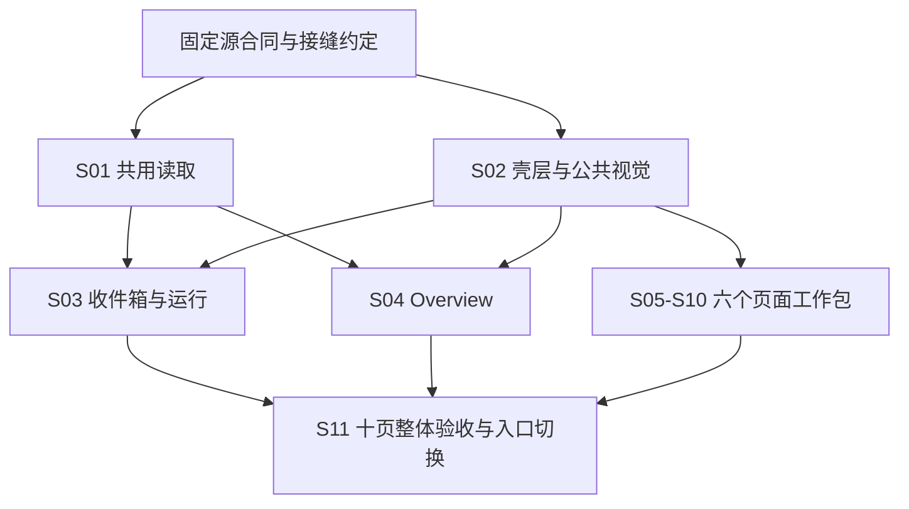

# #92 实现切片与依赖合同

状态：**Q5、Q7 已确认；Q6 按用户要求仅做移动模拟。** 本文是整合合同的一部分，不是产品施工授权；见 [APPROVAL.md](APPROVAL.md) 与 [SPEC.md](SPEC.md)。源合同身份见 [FACTS.md](FACTS.md)。

## 分解原则

- 采用 10 个实现切片和 1 个集成验收切片；代码、对应行为验证及交接材料属于同一工作包。
- S01、S02 分别拥有共享读侧与壳层／公共呈现；页面片通过其约定接缝接入。职责按行为划分，不冻结私有函数名。
- 下表“依赖”表示所需接口／功能就绪；“优先顺序”是执行排程，不能冒充原生硬依赖。待创建实现票时，只有真实阻塞边进入 native dependencies。
- 准备工作是冻结源文档与接口、登记产品基线、给集成分支配置等价 CI。属于各片开工前置，不另造一个产品能力切片。

## 工作包

| ID | 切片与责任 | 依赖 | 切片必须证明的行为边界 |
| --- | --- | --- | --- |
| S01 | 共用只读数据：Overview 完整期间及记忆计数、Run 安全摘要与记录元数据、聚合 Graph 结局／草稿处置、一致用途分组、有界来源／精确回复定位 | 冻结 #88 / #89 来源与公共协议 | 实际 Host / SQLite / HTTP 的完整集合、身份、隐私、错误及资源界限；现有消费者继续可用；无模型调用、无新永久账本 |
| S02 | 壳层与公共视觉：tokens、控件、导航、MainBar / Stream、面板历史、输入守卫、页面生命周期与公共焦点规则 | 冻结 #86 / #87 与 S01 接缝约定；不等待 S01 完整实现 | 九个现有页面在新壳内仍可操作；隐藏保护继续、实际离页正确清理；唯一连接、草稿隔离；默认 Overview 的最终入口 AC 明确交 S11 |
| S03 | 收件箱＋运行：列表／预览／详情、筛选与来源返回、精确回复定位接入、Graph 与导出证据呈现 | S01、S02 | #89 全部现有能力和新增衔接；跨 Session 不误切换，早期回复定位有界，异常及过程缺口不被折叠隐藏 |
| S04 | Overview：三项真实指标、来源分区、静态组件关系、最近运行与详情入口 | S01、S02 | #88 真实完整来源、分区刷新／失效、固定期间跳转、资源回收；优先排在 S03 后完成详情／返回主链验收 |
| S05 | Memory：列表与维护分区、编辑及回执、遗忘进度与隐藏失效、Skill 只读目录 | S02 | #90 Memory 路径；折叠不丢有效输入，保护变化仍生效，完成回执不掩盖剩余清理 |
| S06 | Behaviour：操作表单、拓扑／统计、聚合输入与结果入口 | S02 | #90 Behaviour 路径；图与统计各守来源寿命，聚合草稿与迟到响应隔离；结果进入原目标 Session |
| S07 | Tools：真实来源分组、身份、授权草稿／保存／生效、人格工具发现与详情入口 | S02 | #90 Tools 路径；连接／授权分开、退休来源不恢复权限、页内折叠保留草稿及异常 |
| S08 | Models＋Connections：共同设置来源、各项显式保存、探针反馈、三组连接维护 | S02 | #91 对应完整路径；已有显示名／最后一维覆盖价清空经持久重读证实；冲突、在途编辑、受理未知及清理责任不丢 |
| S09 | Ops：固定账目范围、Run 列表／明细、历史正文与核验、来源返回 | S02 | #91 Ops 路径；财务与正文分别失效，分项金额／覆盖不混合，快照过期返回不偷偷换范围 |
| S10 | Database：目录、SQL 编辑、执行／取消、结果归属／分页／复制与保护清理 | S02 | #91 Database 路径；草稿与提交独立，取消不冒完成，清理未释放不发新查询，遗忘后副本不可复活 |
| S11 | 最终集成与入口切换：十页、跨片链路、最终默认首页、视觉／桌面原生交互／移动模拟／升级回退证据及交接状态 | S01–S10 | 含最终 `/` → Overview 变更的同一候选符合全量迁移合同，差异有解释，依赖与回退范围明确；没有未处理关键 FAIL / BLOCKED |

S03 把精确 MainBar 定位的页面入口和共享读取连成行为证据；壳层中的读取所有权、去重及焦点相关修改仍由 S02 负责人整合。S04 的统计／库存后端集中于 S01，避免在页面片另造口径。S08 的持久设置修复应保留可独立追踪的提交和行为证据；UI 回撤不得无意撤掉仍需保留的修复。

## 依赖与可并行范围

推荐先走通 S03 的主链再完成 S04；这不是 S04 实现必须等待 S03 的硬依赖。S05–S10 可在 S02 接缝稳定后独立施工；其中 Tools → Connections、Tools → Ops → Run、Memory → Behaviour / Database 等两端都迁移后的链路由 S11 补齐集成证据。切片局部通过不得改写跨片路径为已通过。

独立施工使用隔离工作树；公共文件补丁由其负责人或集成者串行整合，保留提交归属。发现新的公共协议冲突先核实已确认合同；若只是私有模块拆分，执行者自行处理，不另开产品访谈。

## 开发过渡与最终候选

- 集成分支允许新壳承载尚未重排的页面内容，但不得用占位成功、假指标或隐藏旧入口掩盖未完成部分。此状态只称开发候选。
- `/overview` 在 S04 可用后加入实际页面入口；此前不以伪内容冒充第十页完成。默认 `/` 的切换由 S11 完成，整体验收必须在切换后的身份上记录。
- 当前 `.github/workflows/ci.yml` 未覆盖目标为集成分支的 PR。施工前给该分支配置明确触发或等价固定候选检查，沿用原项目门禁，不把 main 的旧绿灯移用。
- 后续提交、推送、PR、集成分支写入、进入 main 及运行版本切换分别以实际授权为准；本设计清单不执行这些动作。

## 回退与证据安排

- 每片记录基线、实现提交、依赖、共享契约版本及支持的回退目标；回退后还须满足留下切片的合同。只有完整依赖闭包检查通过，才可称独立可撤。
- S01 / S02 的回撤会影响消费者；S03 等叶片回撤也不得留下其他页指向不存在的新动作。既有旧路由仍要可达，新增入口缺口须与对应依赖一同撤回。
- 升级／回退保留实际用户事实。S08 的清空语义修复和其他必须保留的行为修复与呈现提交分别标识，不能承诺“任意旧提交都安全”。
- 已通过的确定性证据只有在代码、输入、依赖、配置和环境继续适用时复用；组合或候选发生相关变化才补测。最终候选已完成的同项检查不因进入评审阶段重新执行。
- 全部产品／浏览器／桌面原生交互／移动模拟／升级及回退检查目前 **NOT RUN**。iPhone 真机、iOS Safari 与真实移动软键盘为本次明确排除的未执行范围，不是真机通过，也不单独阻塞本次范围内验收。

## 责任补充与切片完成的含义

- S01 的有界定位同时覆盖来源 Session 锚点和精确 Session / Run 正式记录；聚合结局、草稿处置不从 completed 推断。S02 持有 MainBar 定位、按身份合并及回到最新接口；S03 持有动作入口和返回来源。
- S05 负责 Memory 页的 Skill 只读目录；S07 负责 Tools 中的人格工具发现，调用仍经 S02 的 MainBar，证据由 S03 呈现。此路径不新增人格编辑器。
- S08 负责设置清空修复，即使补丁位于公共 settings_commands.py，也不转交给只读 S01。S01 不向 Ops 擅增逐 Run 金额或 recording_state 数据合同。
- 对 pages.js 等共享容器，由 S02 / 集成负责人串行合入各页面片的所属实现；页面 agent 可以提交清楚限定的补丁，不能把整个文件作为独占页面文件重写。私有模块拆分可作为消除冲突的实施选择。
- 页面片的交接状态须写为“本片实现与片内证据就绪，跨片路径待 S11”，直至最终组合完成。切片完成不等于所有引用该片的源路径已整体 PASS；[acceptance-map.json](acceptance-map.json) 的源项状态独立记录。
- 各片建立实际静态资源引用清单。新增页面／模块须同时补包内资源登记、HTTP 可达与加载证据；现有打包文件 hash 通过不能代替资源服务和浏览器导入链。
