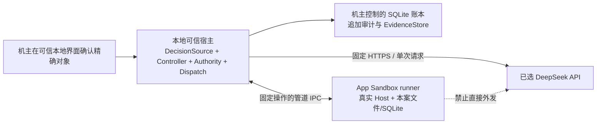

# 本地真实校准推荐方案与最小实施顺序

状态：**DRAFT / NOT APPROVED / NOT EXECUTABLE**。2026-09-28 编制。本文提出合同变更，不认证当前机器已隔离，不签发运行许可。下文“必须”均为建议修订后的验收要求，须用户确认才生效。

## 推荐结论

采用**机主可信、受限 runner 不可信**的个人本地方案：批准、预算、凭据、派发和审计由机主控制的本地可信宿主管理；真实 Agent-Alfred 在 macOS 的受限 runner 内使用真实文件与 SQLite，经宿主调用原选 DeepSeek API。保留两个信任角色，不复制 A/B/C 三个管理域，不要求远程审批服务器、额外管理员、AWS 或本地推理模型。

推荐原生 **App Sandbox launcher + 捆绑 Python helper** 作为 runner 的 OS 边界。机主宿主、launcher、Python 可以是多个进程，但不为每项协议设独立服务器。先验证原生安装产物与沙箱可行性；若必须放开机主 home、网络或凭据才能跑通，明确阻塞并修订适配，不能降格成普通 Python 进程后声称隔离已验收。Apple 官方支持 helper 继承模式，但本仓库依赖组合仍未实测。[Apple helper 文档](https://developer.apple.com/documentation/xcode/embedding-a-helper-tool-in-a-sandboxed-app)

**金额要求推荐保留原强保证**：USD25 覆盖全批模型费用；没有完整计费责任上界与真实强制证据，就停在首条付费请求前。无需因此增加云设施。若用户选择改成有残余账单风险的本地限额，须作为另一份明确变更批准，当前草案不默认采用。

## 信任边界与不承诺的能力

| 主体/层次 | 建议保证 | 明确不保证 |
|---|---|---|
| 机主与其认可的 macOS、可信宿主代码 | 机主可以管理策略、批准、撤回、审计和凭据；无需另一个管理员 | 不防机主/root、恶意内核、宿主被攻陷、管理员改签程序/恢复磁盘/直接使用 API key |
| 受限 agent/runner | 看不到模型凭据、材料金标和其它案例；不能写批准/预算/审计；不能获得管理权、修改候选或绕过宿主直接发送 | 不把当前有 unrestricted shell 的 Codex 会话算作该 runner；不宣称所有同 UID 本地进程都被隔离 |
| 进程内 ModelClient / 工具白名单 | 固定角色、请求形状、工具范围、数据投影、计数与状态机约束 | Python 私有属性、类型检查和 `chmod` 不等于对任意同进程代码的隔离 |
| OS App Sandbox | 无 network client/server entitlement 的 runner 及继承子进程受内核资源限制；特定文件/凭据路径经实际拒绝测试验证 | 不承诺所有系统资源不可见、所有 Keychain API 不可用、所有 exec 不可能；不承诺对受信 broker 的域名级内核封锁 |
| 独立盲复核 | 原判之外的新实例、隔离投影，盲评先封存再对照；不开放产品工具 | 同模型/供应商可能有相关偏差；机主可以看全部材料；同意标签不证明依据充分 |
| 本地审计 | runner 不可写的事件账、原文和高水位；检测不一致/部分提交并停止，完整读回历史 | 非第三方不可否认性、非管理员不可删 WORM、非跨管理域抗共同回滚；同机双文件不证明独立管理 |
| 金额强制 | 受限 runner 无旁路，宿主对每个可能发送先作全额最坏预留，统一实付与未决负债 | 本地公式不能约束供应商错误/未界定收费；请求、token、时间、余额或 402 都不自行证明账单封顶 |

以上放弃了原 P2 的远端审批独立性、跨管理域审计锚和管理者相互制约。保留“对受限 agent 的隔离”，把机主与宿主纳入可信计算基。即使新本地验收通过，也只能报告新合同范围的 PASS，不能声称旧 AWS P2 的保证获得等价证明。

## 最小本地结构

1. **机主控制面。** 一个本地应用/宿主提供摘要审阅、争议、运行许可、检查点和撤回。普通无鉴权 Dashboard 维持原合同，不能顺手变成批准源；新增的是独立受保护的本地审批入口，不是 v1 多用户登录系统。原 ADR-0014 对恶意同机进程的排除不变；新增 runner 的权限隔离属于校准环境。
2. **批准真实性。** 可信界面展示精确摘要、manifest、对象差异、费用和阶段范围，通过机主实际在场的本地认证取得事件。事件包含真实观察到的主体/时间、nonce、对象摘要、用途、有效期、撤回序号；runner IPC 不暴露签发方法。OS 登录身份、challenge 和有效期由宿主取得，不采纳 worker 自填 `subject/at/approved=true`。本机签名仅证明所信宿主作了记录，不证明外部独立权威。
3. **承接旧批准。** r7 的选择已批准，不重新访谈。原聊天缺可核验 message ID/时刻时保留缺口；首次可信本地确认可以记录“现在认证继续采用这些既定对象和已披露范围”的新事件，`original_event_verified=false`，不能回填过去时间或将抄录当原批准源。现有闭合事件协议若不能表达此用途，应新增带版本的承接事件及明确时序校验。逐项承接三条来源争议，仍保留原 `unknown`、D3 和诊断用途限制。
4. **runner。** 捆绑解释器、标准库、扩展库、包、launcher、entitlements、启动参数为同一候选；代码不从 agent 可写路径导入。runner 不继承机主环境、provider socket、凭据 FD、SSH agent、终端/UI 自动化或审计 DB FD。静态系统资源和自身容器访问不被误称为“只能见一个目录”。产品 runner 从未接收完整 batch；judge/reviewer 投影分别隔离。每案新状态，跨角色/跨案进程与容器资料不混用，旧结果转入宿主证据库保存。
5. **IPC 和出口。** 优先使用按实际启动身份绑定的匿名管道/限定 FD；不为 loopback HTTP 给 runner 打开通用网络 entitlement。只允许固定 job/operation/request/result 协议，限制帧大小、顺序、身份、对象和重放。不存在任意 URL/header/path/SQL/shell 转发。宿主固定 `POST https://api.deepseek.com/chat/completions`、校验证书、不跟随重定向、不采用 ambient proxy、不重试。该目的地限制是可信宿主的软件约束；防宿主自身失陷的 OS 域名出口限制不在推荐保证内。
6. **凭据。** 只有宿主 Dispatch 在全部准入通过后取用机主配置的 provider key。建议机主控制且按宿主代码身份授权的 Keychain 项；不默认授权通用 Python 解释器、所有应用或 runner。实际 ACL 与负向读取测试需要后续具体授权，测试先用无价值 sentinel。若采用受保护文件替代，必须取得同等 runner 不可读实证；路径或 `0600` 单独不够。
7. **存储。** 复用 DurableExecutionStore/Anchor 接口及事务/追加算法，为本地可信宿主提供生产适配。账本与追加高水位见证可位于同一机主控制的存储根；保留两步提交/读回的 fail-closed 语义，但不称两个管理域。`fsync`、SQLite 日志模式、独占拥有者、锁/CAS、首次结果原件和部分提交恢复需要实测。完整磁盘回滚可同时回滚两者：不能证明原状态时不恢复原 grant，重新授权也不能抹去未知负债或产生免费额度。

## 可复用代码和真正新增的工作

基线固定为远端 main `da395e20390890e03b0a742c3b957c903b69157a`，不是当前落后 11 个提交的主工作区。以下符号已从该提交读回，源码快照见 `sources/remote-main/`。

| 已交付接缝 | 沿用内容 | 本地增量 |
|---|---|---|
| `EvidenceStore`，`supplement_*`，`judge_protocol.py` | schema4、原件、首结果、固定分母、全部争议、完整摘要、旧 schema 读回 | 注入经过安装验收的本地决定读取器；旧库只读，新结果追加新 store/child |
| `execution_decisions.py:material_binding/DecisionAdmission` | 原/新对象、完整祖先、r7 常量、run/checkpoint 区分、实时撤回 | 闭合登记的本地 source 类型、机主认证/承接事件；不得接受任意 callable 或聊天 JSON |
| `ControlledAuthority` / `ControlledModelClient` | 单次发送、完整 wire 绑定、原子预留、时间 fence、未知责任、资源关闭 | 新本地 runtime 安装器与可信身份/credential/readiness/quote/settlement 适配 |
| `PersistentControlledAuthority` / `DurableExecutionStore/Anchor` | CAS、单一 handler、clean handoff、事件链、恢复停止、原始错误和结算 | 本地生产持久适配和 OS 权限证据；不得把 `synthetic_only=True` 改成 False |
| `DiagnosticDriver` / `CalibrationDriver` | 18+18→检查点→30案→30+30；Host、InputCapture、ModelClient、全部首次记录 | runner 进程边界与类型化 IPC；保留 `_run_case` 实际业务路径和回调/cleanup 语义 |
| `controlled.control`、#99 受保护材料 | 有界消息、受保护内容寻址对象、回执读回、重放不重发 | 本地 FD 传输和调用身份绑定；不另造全套控制协议 |
| 预算和容量工程 | 576 请求、金额单位、9544 事件演示及容量边界、按角色/案共享限制 | 对最终 macOS 安装物复验真实持久/IPC 容量；旧 Mock 结果只在未变范围复用 |

**已核验的硬接缝。** `controlled/runtime.py:617` 的安装器要求 root-owned 文件及 AWS ARN；`:658` 只接纳 `SyntheticRuntime/InstalledRuntime`。`execution_decisions.py:406` 只认可已安装 AWS 来源或限定模拟来源。`controlled/persistence.py:579,595` 的 SQLite 类明确 `synthetic_only=True`；`controlled_persistence.py:69` 拒绝它们与真实 runtime 组合。它们都需要有版本、有测试的本地分支，不能靠配置解锁。

**进程拆分并非已经交付。** `controlled_calibration.py:197` 的 `_ControllerFactory` 和 `:377` 的 `_product` 当前在同一 trusted controller 中调用 Host。本地桥接不得把 controller 身份或 `prepare_request` 特权交给 runner，再接受其自报角色/数据范围。宿主必须从固定计划选择操作，以受审投影逻辑核对完整请求、可见种子和已记录工具事实；worker 返回的工具成功/持久状态需由实际文件、SQLite 和账本证据交叉核验。若该边界无法成立，不能以“只有 IPC”宣称通过。

推荐新增 `owner_trusted_local` 信任配置及显式本地安装入口，保留 AWS 和 synthetic 各自语义。具体文件名留给 implement-spec，不提前扩成通用云/多租户插件框架。新版本报告必须写出本地保证范围；不能给旧 `independent_anchor_verified` 字段填 True 冒充跨域证明。

## USD25 的证明路径与取舍

已批请求名为 `deepseek-flash` / `deepseek-v4-pro`。当前公开资料分别映射为 V4.1-Flash / V4-Pro-0813，原方案已记录相同映射，故不重新选择模型；账户路由、回包身份和不可固定的服务端版本仍待运行前核验。不同字符串并不足够。[DeepSeek 定价](https://api-docs.deepseek.com/quick_start/pricing/)

按峰值且全输入 cache miss 的旧批准情景，Flash `480×(20000×0.30+8192×1.20)/10^6 = USD7.598592`；Pro `96×(24000×1.32+16384×3.96)/10^6 = USD9.26982144`；合计 **USD16.86841344**。距 25 的余量不是保证。完整输入计量、真实输出上界、适用费率/期限/舍入、税/汇率/附加费仍须分别有证据。公开文档未提供本账户严格结算封顶证明；没有读取真实账户。[计费与 OS 研究](LOCAL-BILLING-OS-RESEARCH.md)

| 证明路线 | 需要什么 | 当前结论 |
|---|---|---|
| A：完整计费责任上界 + 本地强制，推荐优先调查 | 账户适用且覆盖所有收费变量的最大额规则；完整 payload 输入和最大输出证明；每次发送前原子保守预留；runner 无旁路；只释放已核实结算后的余量 | 未取得完整上界和实际本地强制证据，BLOCKED；这是原合同可接受路线，不额外强制必须有供应商 cap 按钮 |
| B：供应商/支付侧严格最终责任封顶 | 适用该账户/币种/全部扣款来源与在途责任的封顶证明，明确自动充值、授信、其它消费、税/汇率、追补；仍保留本地统一账 | 未取得。信用卡额度或停付不一定消除已形成债务；仅余额/402 不通过 |
| C：改为本地 USD25 授权控制 + 条件估计 | 用户明确接受供应商最终账单可能超出 25 的残余风险；新合同改名并记录差异，不能继续报告原 `hard_cap_required` 已满足 | **不推荐作为默认；本草案未启用**。仍需后续真实运行许可，不能从旧 Q14 恢复 unknown 模式 |

宿主应维持 `S + U + R_next <= USD25`：S 为已验证支出，U 为全部未决最坏负债，R_next 为下一次完整收费最坏值，按计费最小单位向上取整并在同一事务预留。缺任一上界就不能算 R_next；不得用零或平均数。S 还须涵盖在本批授权范围内的失败、诊断、辅助与复核，不以换角色/目录/进程清账。发现实际收费违背已证上界时记录真实额及 `billing_bound_violated`，立即停新请求；这说明保证失效，不能把超额裁剪成 25。

真实 `quote/settlement` 的依据须能追溯到适用计费条款、原请求及供应商usage/结算事实，并标明“估计/响应计量/已结清”的区别。将原KMS读回换成本机签名不会自动补齐计费真实性；机主认可一张价表也不能凭空认证其完整收费上界。原unknown直到可核验结算为止都保留保守负债。

取消云端基础设施后没有自动新增云预算。现有 Mac、电力、磁盘不作为新的按次模型收费；如新增付费签名、托管或软件服务，先单列具体成本和授权，不混入或绕开 USD25。实际账户其它消费者必须排除或可归因分账，不能用账户余额变化冒充本批费用。

## 最小实施与验收顺序（本轮不执行）

| 步骤 | 归属及产物 | 验收/停止条件 |
|---|---|---|
| 0 | 用户确认本地合同和金额保证；随后另行进入 implement-spec | 新合同未确认不实施；本次不是 grant、阈值或 GitHub 发布许可 |
| 1 | #98 补本地适配的最小边界验证：固定 Python 安装物、App Sandbox launcher、窄 IPC，先无密钥/无外网模型 | 实际拒绝读取 sentinel、无网络 entitlement、继承子进程受限；兼容失败不能扩大权限掩盖。测试产生的本地安装/权限操作需明确范围授权 |
| 2 | #98 连接 Local DecisionSource/Runtime/生产持久适配与原 Authority；单案到完整阶段离线验证 | 不改旧 synthetic 守卫；测试批准明确 synthetic；首结果、预算、撤回/崩溃/未知责任及真实安装字节均有检查。默认入口仍拒绝 |
| 3 | #105 对最终 macOS 本地候选验实际权限/凭据隔离/出口/停止与审计 | 用无价值 secret、实际 runner/子进程、受控非计费目标和新测试存储；独立机主读取策略/日志；完整证据按本地合同分类。不是供应商结算或模型质量证明 |
| 4 | #106 补账户适用计费上界/强制、实际模型身份、精确提案和可信机主运行事件 | A 或 B 金额路线可证、绑定完整候选和材料；若要模型探测须单独具体授权且记账。#106 到首请求前，不启动原时钟 |
| 5 | #98 承接真实执行记录：机主明确启动同一 job | 先 18 裁判诊断 + 18 盲复核，封存、对照、完整摘要；全部共用总额、计数和原 10800 秒 |
| 6 | 机主只审诊断摘要和争议并决定是否继续 | 精确 checkpoint；无确认/争议未决/到时/撤回则不发产品请求。禁止项漏判不能被一致率抵消 |
| 7 | 同一 job 六组交错真实 30 案，再最多 30 原判 + 30 盲复核 | 每案全新真实文件/SQLite；首次结果固定；无输出案不伪造判分，所有未运行案仍留分母；本地对照不暗增 48 次 API |
| 8 | 关闭新派发、结算与完整摘要；#83 接收质量决策材料 | 校准阶段完成/质量合格/阈值批准分别表示；用户批准具体分子分母、错误代价、允许失败数与通用政策；不能默认 95% |
| 9 | #83 后续正式 120 案、隔离复核、冻结和另行授权 | 每组 8/8/4；126 家族排除及来源缺口保留；7 天从实采算；正式结果及完整发布合同齐备后按真实条件判断 |

步骤是同一增量的依赖顺序，不是新增拆票。#99–#104 保持已交付事实，不重开重写；#105/#106 的内容通过本轮草案修订。#98 的工程/运行前置验收完成口径与真实校准进度分列，不能把 #106 首请求前完成写成校准成功。#83 在真实校准、判分复核、阈值和最终合同未闭合时继续 OPEN。

未来工程验证沿用 CPython 3.14 的项目必需检查、Ubuntu CI 和 macOS 安装路径；变更影响的来源/权限/持久/预算/并发必须验证，未变确定性结果按原候选与环境范围复用。无需为了本轮纯文档重新运行 6117 项或完整 Mock。

## 实际本地运行前检查

- 精确候选：宿主/runner/解释器/依赖/签名/entitlements/协议/材料 manifest/输出 namespace 一致；主工作区未提交内容不混入。
- 身份与源：机主真实在场事件、原 r7 承接、三条争议范围、run 与 checkpoint 分离；来源失联/撤回后不能继续。
- runner 权限：读 provider sentinel、机主文件、gold、另案材料、批准/账/锚、改候选、越界 symlink/路径/FD、提权与子进程继承均按预期拒绝；记录实际主体和错误。
- 出口：runner IPv4/IPv6、TCP/UDP、DNS/loopback、继承 socket、代理/系统代发旁路实际被拒绝；宿主只接受固定 provider 请求，任意 URL/header/重定向/proxy 无法由 runner 操纵。拒绝与简单超时分开记录。
- 业务事实：真实 Host、本案文件/SQLite、重启读回、工具账/Attempt/输入投影真实对应；没有产品金标泄露，没有以 fixture 替代业务结果。
- 持久与停止：部分写入、并发占额、clock rollback、休眠/恢复、失联、正常 handoff、突然 crash/磁盘恢复、丢响应、清理失败均保持原起点/首次错误/负债；异常恢复不重发。
- 金额与模型：A/B 路线证明、完整 token、全部费项/期限、请求名及实际映射、无重试/流式/暗中健康探测，所有收费操作有事前绑定。
- 阶段与报告：18+18 的 checkpoint 前零产品发送；18题不入产品分母；实际完成/缺失的48盲评槽全部出现；历史 FAIL、争议、D3、c25 和未运行案保留。

本机权限/网络/凭据测试和真实调用均 **NOT RUN**；这些是未来验收项，不是本次检查结果。
